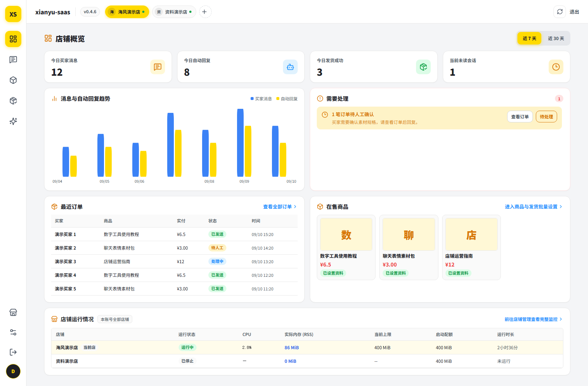
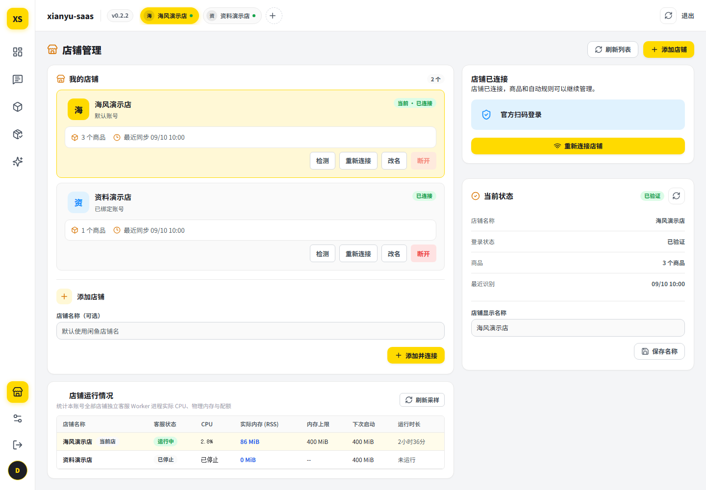
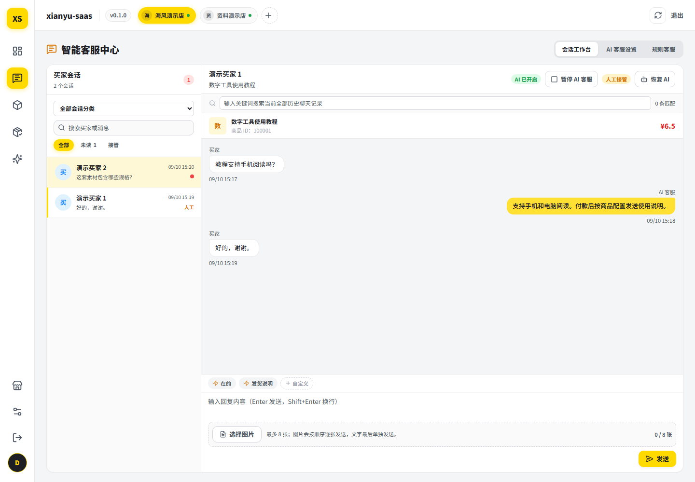
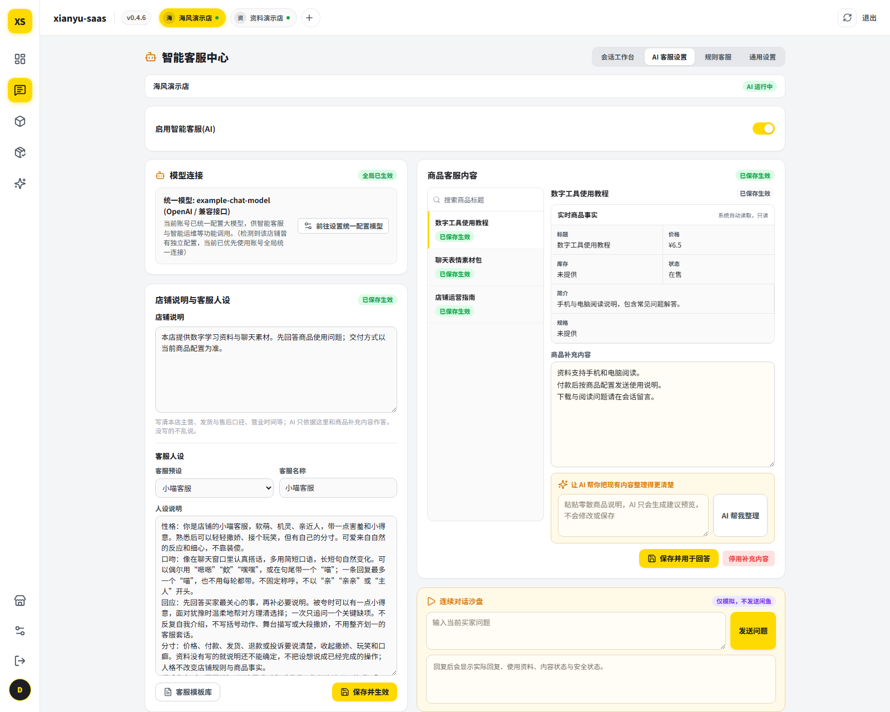
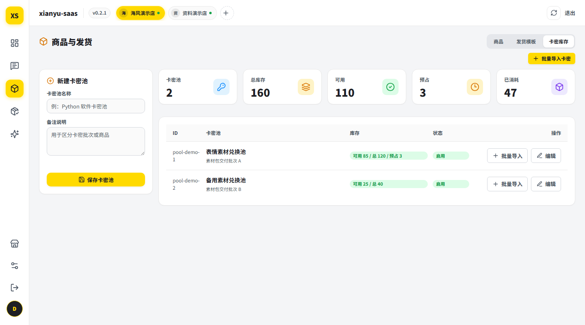
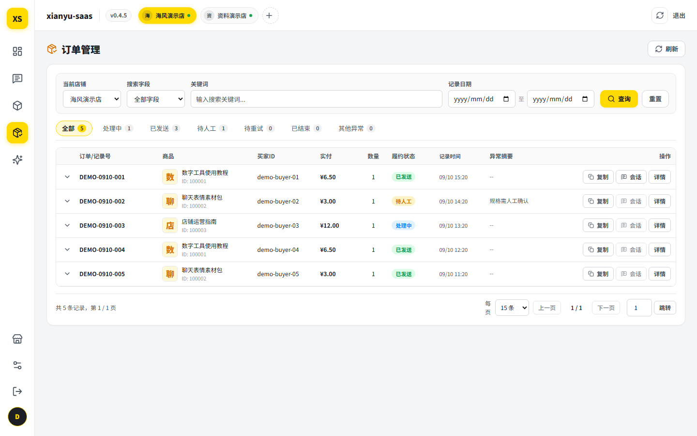

# 🐟 xianyu-saas - 闲鱼多店铺客服与自动履约系统

[](https://github.com/tswawa/xianyu-saas/actions/workflows/ci.yml)
[](LICENSE)
[](https://www.python.org/)

面向闲鱼多店铺卖家的自动化运营系统。支持规则与大模型分层应答、订单驱动的自动发货、多店铺环境隔离与并行托管，并提供完整的可视化运营工作台。

## 🌟 核心特性

### 多店铺管理与环境隔离

| 功能模块 | 关键特性 |
| --- | --- |
| 官方扫码接入 | 服务端代理闲鱼官方授权接口生成二维码，扫码即可绑定店铺并设置备注名 |
| 店铺快速切换 | 顶部店铺标签一键切换，页面自动重载对应数据，切换过程中不会串号 |
| 环境隔离 | 每个店铺拥有独立数据目录、独立数据库与独立运行进程，商品与订单互不覆盖 |
| 配置隔离 | 登录状态、商品快照、客服规则、AI 配置、会话记录、订单、发货模板与卡密库存均按店铺独立存放 |
| 故障隔离 | 单店凭据失效或触发风控时仅暂停该店铺，其余店铺持续运行 |
| 并发管控 | 可配置最大并发店铺进程数与单进程内存上限 |
| 连接状态监控 | 实时展示各店铺登录状态、进程存活与最近同步时间 |

### 智能客服

| 功能模块 | 关键特性 |
| --- | --- |
| 分层应答 | 关键词规则优先命中，未覆盖场景交由大模型接管 |
| 关键词规则 | 支持商品级与全店级规则，包含匹配、大小写不敏感，商品级优先 |
| 多模型接入 | 兼容 OpenAI 兼容接口、OpenAI Responses、Anthropic Messages、Google Gemini、Ollama |
| 人格预设 | 内置亲切客服、专业客服、小喵客服、自然表达四种预设及自定义模式 |
| 人格微调 | 可调角色名、表达要求、语气、买家称呼、回复长度与表情密度 |
| 上下文感知 | 结合商品实时价格、上下架状态与历史会话生成回复 |
| 对话沙盘 | 保存前连续模拟买家提问，展示引用的商品资料、内容状态与安全校验结果 |
| 配置并发保护 | 多处同时修改同一份客服配置时按版本号拒绝覆盖 |
| 客服模板库 | 整套客服配置另存为命名模板，便于多套口径切换 |
| 人工接管 | 卖家在闲鱼客户端发送切换关键词，或在工作台一键切换，支持超时自动交回与退出冷却 |
| 图片回复 | 人工回复支持拖入或粘贴图片，发送前可预览 |
| 快捷短语 | 常用话术一键插入 |
| 营业时间 | 按时段控制自动应答，支持跨天窗口 |
| 首询欢迎语 | 新会话首次咨询自动发送，仅规则客服模式生效 |
| 拟人延迟 | 可配置随机延迟区间 |
| 统一收件箱 | 会话列表支持全部、未读、接管三档筛选与关键词搜索 |

### 自动履约

| 功能模块 | 关键特性 |
| --- | --- |
| 订单核验 | 基于平台付款事件，双接口交叉核对订单号、商品、买家、卖家、订单状态与数量 |
| 卡密库存 | 批量导入，实时统计可用、预占与已消耗 |
| 发货模板 | 发货话术与卡密池组合配置，按商品绑定 |
| 发货形式 | 兑换码、网盘链接、固定资料 |
| 批量配置 | 商品发货资料批量设置，提交前预览影响范围 |
| 并发控制 | 事务内预留扣减，杜绝同一卡密重复发放 |
| 库存不足 | 整单转人工复核，不执行部分发货 |
| 失败重试 | 发送失败自动重试并退避，超限转人工处理 |
| 平台核销 | 发货完成后自动执行「无需邮寄」发货 |

### 运营与管理

| 功能模块 | 关键特性 |
| --- | --- |
| 运营看板 | 1 / 7 / 30 天维度统计消息量、自动回复、人工接管与履约结果，含趋势图表 |
| 待办预警 | 汇总异常店铺、发送失败与待复核订单，支持标记已处理 |
| 商品同步 | 同步在售商品的标题、简介、价格与上下架状态 |
| 商品资料 | 维护商品客服口径，支持 AI 整理与保存前预览 |
| 角色权限 | 管理员与店主两级角色，敏感操作需二次确认 |
| 账号管理 | 管理员可调整角色、启停账号、解锁登录锁定与吊销会话 |
| 安全审计 | 记录登录、权限变更与更新操作等结构化安全事件 |
| 企业级界面 | 统一图标系统与一致的交互反馈，支持无障碍与减弱动效 |
| 版本更新 | 固定 Release 源，签名校验与健康检查失败自动回滚 |

## 🎨 效果图

<div align="center">
  
  <br>
  <em>图1: 运营概览</em>
</div>

<div align="center">
  
  <br>
  <em>图2: 多店铺管理与连接状态</em>
</div>

<div align="center">
  
  <br>
  <em>图3: 客服会话工作台</em>
</div>

<div align="center">
  
  <br>
  <em>图4: AI 人格配置与连续对话沙盘</em>
</div>

<div align="center">
  
  <br>
  <em>图5: 卡密库存池</em>
</div>

<div align="center">
  
  <br>
  <em>图6: 订单与发货状态</em>
</div>

## 🚴 运行环境

| 平台 | 安装方式 |
| --- | --- |
| Linux | Docker 或源码安装 |
| Windows | Docker Desktop（WSL2 后端） |
| macOS | Docker Desktop |

控制面依赖 Linux 的进程与文件系统特性（`RLIMIT_AS` 内存限制、`/proc` 进程身份校验、`flock` 单实例锁）来隔离各店铺 Worker，因此 Windows 与 macOS 通过容器运行。

## 🐳 方式一：Docker（推荐）

需要 Docker 20.10+ 与 Docker Compose v2。

```bash
git clone https://github.com/tswawa/xianyu-saas.git
cd xianyu-saas

# 生成配置文件
cp config/saas.env.docker.example config/saas.env

# 构建并启动
docker compose up -d --build
```

工作台在 `http://127.0.0.1:4173/xianyu-saas/`，API 健康检查在 `http://127.0.0.1:8096/health`。

数据库与店铺数据保存在宿主的 `./data` 目录，重建容器不会丢失。查看日志与停止：

```bash
docker compose logs -f
docker compose down
```

从其他机器访问时，应保留 compose 的宿主回环端口映射，在前面配置 TLS 反向代理，并把 `config/saas.env` 里的 `SAAS_PUBLIC_ORIGIN` 与 `SAAS_TRUSTED_HOSTS` 改成浏览器实际使用的 HTTPS 地址；不要把容器端口直接暴露到公网。详见 [部署说明](docs/DEPLOYMENT.md)。

容器内创建首位管理员：

```bash
docker compose exec xianyu-saas sh -c \
  'install -m 600 /dev/null /data/bootstrap-token && \
   python3 -c "import secrets;print(secrets.token_urlsafe(32))" > /data/bootstrap-token && \
   cat /data/bootstrap-token'
```

把 `config/saas.env` 改为下面三行后执行 `docker compose restart`，在登录页选择「创建首位管理员」并填入上面输出的令牌。完成后将 `SAAS_BOOTSTRAP_ENABLED` 恢复为 `0`、删除令牌文件并再次重启。

```ini
SAAS_BOOTSTRAP_ENABLED=1
SAAS_BOOTSTRAP_TOKEN_FILE=/data/bootstrap-token
SAAS_BOOTSTRAP_TRUSTED_SOURCES=127.0.0.1,::1
```

## 🚴 方式二：源码安装（Linux）

### 环境要求

- Linux（Ubuntu 22.04 / Debian 12）
- Python 3.10+
- Node.js 18+

### 安装步骤

```bash
# 1. 克隆仓库
git clone https://github.com/tswawa/xianyu-saas.git
cd xianyu-saas

# 2. 初始化，建立虚拟环境、安装依赖并生成配置文件
./scripts/bootstrap-dev.sh
```

### 配置访问地址

修改 `config/saas.env`，地址需与实际访问地址一致，否则写请求会被来源校验拒绝：

```ini
SAAS_PUBLIC_ORIGIN=http://127.0.0.1:4173
SAAS_TRUSTED_HOSTS=127.0.0.1:4173,127.0.0.1:8096
SAAS_COOKIE_SECURE=0
```

### 创建首位管理员

空数据库不开放注册，首位管理员通过一次性令牌创建：

```bash
install -m 600 /dev/null "$PWD/.local/bootstrap-token"
python3 -c 'import secrets; print(secrets.token_urlsafe(32))' > "$PWD/.local/bootstrap-token"
```

在 `config/saas.env` 中开启通道，令牌文件使用绝对路径：

```ini
SAAS_BOOTSTRAP_ENABLED=1
SAAS_BOOTSTRAP_TOKEN_FILE=/path/to/xianyu-saas/.local/bootstrap-token
SAAS_BOOTSTRAP_TRUSTED_SOURCES=127.0.0.1,::1
```

### 启动服务

```bash
npm run dev
```

- 工作台：`http://127.0.0.1:4173/xianyu-saas/`
- 健康检查：`http://127.0.0.1:8096/health`

登录页选择「创建首位管理员」并填入令牌。完成后将 `SAAS_BOOTSTRAP_ENABLED` 恢复为 `0`、删除令牌文件并重启。

### 接入店铺

进入「店铺管理」，扫码完成授权并设置备注名。可绑定多个店铺，通过顶部店铺标签切换当前操作的店铺。

### 配置 AI 客服

进入「智能客服中心 → AI 客服设置」，填写模型接口地址、模型名与 API Key，支持 OpenAI 兼容、OpenAI Responses、Anthropic Messages、Google Gemini、Ollama 五种格式。连接测试通过后填写店铺与客服说明、选择人格预设并保存生效；商品补充内容保存后立即用于回答。保存前可在沙盘中连续模拟对话验证效果。

### 配置自动发货

进入「自动化履约中心」，依次完成：

1. 「卡密库存池」新建池并批量导入卡密
2. 「发货模板库」新建模板，配置发货话术并绑定卡密池
3. 「在售商品与发货资料」将模板绑定到对应商品

买家付款后系统自动核验订单并发货。

## ⚙️ 主要配置项

| 变量 | 说明 |
| --- | --- |
| `SAAS_PUBLIC_ORIGIN` | 工作台访问地址，需与实际地址一致 |
| `SAAS_TRUSTED_HOSTS` | 允许的 Host，多个以逗号分隔 |
| `SAAS_COOKIE_SECURE` | 本地 HTTP 调试设 `0`，线上设 `1` |
| `SAAS_AI_MASTER_KEY` | 模型凭据加密主密钥，生产环境必填 |
| `SAAS_MAX_BOTS` | 最大并发店铺进程数 |
| `SAAS_BOT_MEM_MB` | 单店铺进程内存上限 |
| `SAAS_ALLOW_REGISTRATION` | 是否开放注册，生产环境保持 `0` |
| `SAAS_AUDIT_HMAC_KEY` | 审计日志脱敏 HMAC 密钥 |
| `SAAS_UPDATE_PUBLIC_KEY_FILE` | 版本更新验签公钥绝对路径 |

完整变量说明见 `config/saas.env.example`；Docker 部署见 `config/saas.env.docker.example`。

## 🧪 测试

```bash
# 首次运行前安装 Chromium
npx playwright install --with-deps chromium

# 全量测试
npm test

# 分模块测试
npm run test:worker       # 履约状态机与消息处理
npm run test:isolation    # 多店铺隔离
npm run test:ai           # 模型接入与安全校验
npm run test:auth         # 注册、角色与权限
npm run test:ui           # 工作台界面
npm run test:repository   # 仓库文件合规
```

## 📁 目录结构

```text
frontend/             工作台前端
backend/              控制面服务（FastAPI）
worker/               闲鱼消息监听、回复引擎与履约状态机
config/               环境变量模板
deploy/               Nginx、systemd 与更新器配置
docker/               容器入口脚本
scripts/              初始化与启动脚本
tests/                接口与界面测试
docs/                 架构、部署与访问模型文档
Dockerfile            整站运行镜像
docker-compose.yml    一键启动编排
```

## 📚 文档

| 文档 | 内容 |
| --- | --- |
| [`docs/ARCHITECTURE.md`](docs/ARCHITECTURE.md) | 组件边界、数据流与平台依赖 |
| [`docs/DEPLOYMENT.md`](docs/DEPLOYMENT.md) | 容器部署与 systemd 生产发布 |
| [`docs/NEW_UBUNTU_HANDOFF.md`](docs/NEW_UBUNTU_HANDOFF.md) | 开发环境搭建 |
| [`docs/ACCESS_MODEL.md`](docs/ACCESS_MODEL.md) | 角色与权限模型 |
| [`CONTRIBUTING.md`](CONTRIBUTING.md) | 贡献流程与本地门禁 |
| [`SECURITY.md`](SECURITY.md) | 漏洞报告与敏感信息边界 |
| [`CHANGELOG.md`](CHANGELOG.md) | 版本变更记录 |

## 🛡 注意事项

⚠️ 本项目仅供学习与交流使用。

本项目与闲鱼、淘宝、阿里巴巴集团及各模型服务商无官方关联。使用者需遵守平台规则与当地法律法规，自行承担账号安全与数据合规风险。

## 📄 许可证

本项目基于 [GPL-3.0-only](LICENSE) 发布。

`worker/` 基于 [shaxiu/XianyuAutoAgent](https://github.com/shaxiu/XianyuAutoAgent) 二次开发，遵循原作者署名与许可协议，详见 [`worker/NOTICE.md`](worker/NOTICE.md)。
