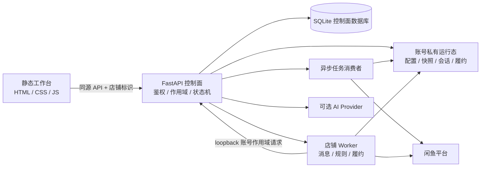

# 闲鱼客服工作台

[](https://github.com/tswawa/xianyu-saas/actions/workflows/ci.yml)
[](LICENSE)
[](docs/PUBLIC_RELEASE_CHECKLIST.md)

> 面向自部署店主的账号隔离型闲鱼客服工作台：把客服对话、店铺运营、订单履约和可选 AI 能力收进一套可审计、可恢复的业务控制面。

这是一个按店铺账号隔离的单仓库应用，包含静态运营工作台、FastAPI 控制面、异步任务消费者、店铺级自动客服 Worker、部署模板和离线合同测试。项目当前作为 **private 内部构建基线** 维护；真实平台、真实订单、第三方模型和生产环境验收始终单独进行。

## 项目定位

这个项目不追求把所有业务逻辑塞进浏览器，而是把关键状态放在服务端和账号私有运行态中：

- 前端负责低学习成本的操作和展示，不保存平台 Cookie、Token 或模型密钥；
- FastAPI 控制面负责鉴权、账号作用域、店铺连接、任务状态和 Worker 生命周期；
- 每个店铺账号拥有独立的配置、商品快照、会话库、履约库和 Worker 运行态；
- AI 只生成客服文本或安全的人工接管决策，不能授权发货、改变订单状态或跨店铺读取资料；
- 自动履约只接受经过多重核验的平台订单证明，不接受买家文字、商品标题或模型输出作为授权。

## 六个业务域

| 业务域 | 解决的问题 | 当前能力 |
| --- | --- | --- |
| **运营概览** | 快速知道哪些店铺和任务需要处理 | 连接状态、Worker 状态、失败/重试任务和人工待办摘要 |
| **智能客服** | 集中处理买家咨询，必要时人工接管 | 会话搜索、历史消息、人工接管、快捷回复、可选 AI 回复 |
| **履约中心** | 管理商品资料和受控交付流程 | 商品客服内容、兑换码/网盘资源配置、订单证明后的自动履约 |
| **订单管理** | 追踪订单状态与处理结果 | 订单状态、履约记录和有界的结果摘要 |
| **店铺管理** | 安全连接和切换多个店铺 | 官方二维码连接、账号切换、状态恢复和账号级配置 |
| **项目说明** | 让维护者理解配置和边界 | 开发配置、安全约定、能力说明和验证入口 |

## 核心能力

- **账号级隔离**：所有可写业务数据绑定 `user_id + account_id/account_key`，迟到请求也按账号、商品和代次复核。
- **官方连接流程**：普通页面只展示服务端生成的官方二维码，不接收浏览器导出的 Cookie 或 Token。
- **统一收件箱**：按买家会话隔离历史，支持搜索、未读状态、人工接管和恢复。
- **可靠人工回复**：人工回复进入账号私有持久 outbox，使用发送期租约、稳定消息标识和有界重试。
- **异步同步**：店铺同步任务由独立 consumer 消费，具备租约、退避、重试和死信边界。
- **内容驱动 AI**：模型上下文由店主自然语言内容、当前店铺信息、实时商品事实和当前会话组成；内部 JSON 只作为协议和私有存储。
- **受控 provider 连接**：支持 `openai_chat_completions`、`openai_responses`、`anthropic_messages`、`google_gemini` 和 `ollama_chat` 五种固定格式，并限制解析、重定向和响应体。
- **履约安全闸门**：自动发货前核验订单号、商品、买家、卖家、状态和数量，并通过事务库存预留控制副作用。
- **故障可恢复**：配置损坏时 fail-closed，任务和 Worker 重启恢复不重放失效版本的旧正文。

## 架构



### 运行时边界

| 组件 | 职责 | 不负责的事情 |
| --- | --- | --- |
| `frontend/` | 页面交互、状态展示和请求代次保护 | 保存凭据、实现平台登录、决定权限 |
| `backend/` | 鉴权、账号隔离、二维码连接、同步任务、AI 统一引擎 | 直接替代平台订单证明 |
| `backend/job_consumer.py` | 单写者消费异步店铺同步任务 | 保存 Cookie 原文或绕过账号作用域 |
| `worker/` | 入站消息、规则/AI 回复、人工 outbox 和履约 | 由模型输出直接触发发货 |
| `deploy/` | nginx、systemd、Docker 和日志轮转模板 | 提供生产密钥或固定主机路径 |

## 仓库导航

| 路径 | 用途 |
| --- | --- |
| `frontend/` | 静态运营工作台，不保存平台凭据 |
| `backend/` | FastAPI 控制面、鉴权、店铺连接、任务和 Worker 管理 |
| `worker/` | 店铺消息、规则/AI 回复、人工回复和履约 Worker |
| `connector-extension/` | 独立的浏览器连接兼容资产，仅按专门合同验证 |
| `deploy/` | nginx、systemd、Docker 和日志轮转模板 |
| `tests/` | API、AI、隔离、恢复、部署、扩展和 UI 合同 |
| `docs/` | 架构、开发、部署、产品边界和发布清单 |
| `handoff/` | 私有协作规则、稳定架构事实和交接说明 |

## 快速开始

### 环境要求

- Ubuntu 22.04/24.04 或兼容 Linux；
- Python 3.10+（含 `venv`）；
- Node.js 20+、npm 10+；
- 浏览器测试需要 Playwright Chromium。

### 安装开发依赖

```bash
./scripts/bootstrap-dev.sh
npx playwright install --with-deps chromium
```

脚本会创建本机未跟踪的 `config/saas.env`、`worker/.env` 和 `.local/` 运行态目录。只填写测试环境值，不要把真实凭据复制到仓库。

### 启动本地工作台

```bash
npm run dev
```

默认地址：<http://127.0.0.1:4173/xianyu-saas/>。

本地开发脚本会启动 API、任务消费者和静态页面服务。生产环境请使用 `deploy/` 中的模板，并由维护者在目标主机单独配置域名、密钥、权限和运行态目录。

### 配置原则

- 开发环境可将 `SAAS_ALLOW_REGISTRATION` 设为 `1`；生产必须保持关闭；
- `SAAS_COOKIE_SECURE=0` 只适用于本机 HTTP，生产必须使用安全 Cookie；
- AI 主密钥和上游 API Key 只放在未跟踪的环境文件或安全密钥管理系统；
- `worker/.env` 中的 `COOKIES_STR` 只允许在受控测试账号场景使用；
- 不要修改仓库中的空商品映射或示例配置来保存真实业务数据。

## 测试与质量门禁

完整门禁：

```bash
npm test
```

常用专项检查：

```bash
npm run test:repository
npm run test:syntax
npm run test:api
npm run test:ai
npm run test:recovery
npm run test:auto-worker
npm run test:isolation
npm run test:manual-reply
npm run test:worker
npm run test:ui
```

测试默认使用临时目录、模拟平台和脱敏样例。真实扫码、验证码、安全认证、第三方模型、商品同步、订单履约和生产发布必须由负责人安排受控验收，不得使用生产订单盲测。

## 当前验证状态

| 范围 | 状态 | 说明 |
| --- | --- | --- |
| 仓库结构、许可证和敏感信息排除 | **已验证** | `python3 tests/repository-contract.py` 通过 |
| API、账号隔离、AI、任务恢复和人工回复合同 | **已验证** | 完整 `npm test` 通过 |
| Worker 与桌面/移动 UI 合同 | **已验证** | Worker 测试和 Playwright 合同通过，覆盖桌面与 390px |
| 本机开发实例 | **已验证** | API 存活/就绪、未登录鉴权响应和静态资源检查通过 |
| 真实闲鱼扫码、风控恢复和实时消息 | **未验证** | 需要真实账号和受控窗口 |
| 真实第三方模型调用与模型质量 | **未验证** | 需要由维护者提供测试配置并单独验收 |
| 真实订单、库存和发货 | **未验证** | 不使用生产订单做盲测 |
| nginx/systemd 生产加载 | **未验证** | 本仓库只提供模板，未代替目标主机部署 |

## 安全与隐私

请先阅读 [`SECURITY.md`](SECURITY.md)。以下内容永远不应进入 Git、Issue、Pull Request 或日志片段：

- Cookie、Token、API Key、密码和二维码登录态；
- 真实订单号、买家昵称、聊天正文、库存、兑换码和网盘资料；
- 数据库、备份、生产日志、内部域名和主机路径。

发现安全问题请使用 GitHub Security Advisory 私下报告，不要公开发布可复用凭据或攻击细节。更多安全边界见 [`docs/ACCESS_MODEL.md`](docs/ACCESS_MODEL.md) 和 [`docs/DEPLOYMENT.md`](docs/DEPLOYMENT.md)。

## 文档入口

- [架构概览](docs/ARCHITECTURE.md)
- [账号与访问模型](docs/ACCESS_MODEL.md)
- [AI 客服内容驱动需求](docs/AI-CUSTOMER-SERVICE-REQUIREMENTS.md)
- [部署指南](docs/DEPLOYMENT.md)
- [新 Ubuntu 交接](docs/NEW_UBUNTU_HANDOFF.md)
- [贡献指南](CONTRIBUTING.md)
- [许可证边界](LICENSING.md)
- [安全约定](SECURITY.md)
- [公开发布前清单](docs/PUBLIC_RELEASE_CHECKLIST.md)
- [更新记录](CHANGELOG.md)

## 贡献

欢迎修复可复现的工程问题和补充离线合同。提交前请阅读 [`CONTRIBUTING.md`](CONTRIBUTING.md)、[`LICENSING.md`](LICENSING.md) 和 [`docs/ARCHITECTURE.md`](docs/ARCHITECTURE.md)。

贡献要求包括：

- 说明用户影响、失败路径和恢复方式；
- 保持账号/店铺隔离；
- 新环境变量同步更新 `*.example` 模板；
- 运行仓库合同、完整测试和 `git diff --check`；
- 影响 `worker/` 时保留 GPL-3.0 和上游 NOTICE 边界。

## 许可证与免责声明

除文件另有说明外，本仓库原创内容按 [GPL-3.0-only](LICENSE) 授权。`worker/` 基于 [shaxiu/XianyuAutoAgent](https://github.com/shaxiu/XianyuAutoAgent)，其来源和许可证见 [`worker/NOTICE.md`](worker/NOTICE.md) 与 [`worker/LICENSE`](worker/LICENSE)。字体资产遵循随附的 OFL 1.1 条款，完整边界见 [`LICENSING.md`](LICENSING.md)。

本项目不是闲鱼、淘宝、阿里巴巴或任何模型服务商的官方软件。使用者须自行遵守相关平台服务条款、隐私法规、数据保护要求和适用法律，并自行承担账号、数据、模型调用和平台策略变化带来的风险。
