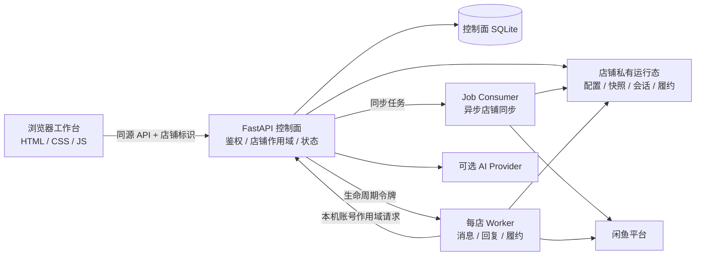

# xianyu-saas

一个给自己管店用的闲鱼店铺管理工作台。

[](https://github.com/tswawa/xianyu-saas/actions/workflows/ci.yml)
[](LICENSE)

如果你想尝试一下更现代化的闲鱼店铺管理器，可以看看这个项目。

做闲鱼数字商品，最先遇到的通常是自动回复：来消息了，按关键词回一句。店铺和商品多起来以后，麻烦会换一副样子：不同店铺的资料容易混用，服务重启后要担心消息重复处理，人工接手以后自动回复还在继续，付款提醒来了却很难确认这单到底该不该发货。

xianyu-saas 就是从这些日常问题开始做的。它把店铺、客服、订单和发货资料放到同一个工作台里，每个店铺单独保存自己的运行数据和 Worker。消息先进入系统，再按规则、AI 或人工的路径处理；订单走自己的核验流程，资料发出前还会重新检查状态。

项目面向自部署、自己维护店铺的人。仓库里的离线合同和本机开发环境已经跑通，真实闲鱼账号、真实模型、真实订单和生产服务器还需要单独验收。

## 界面

<p align="center">
  
  
</p>

上面的截图来自脱敏测试夹具，只用来展示界面结构。

## 工作台里有什么

工作台分成六个业务区域。日常操作集中在四个主入口，店铺管理和项目说明放在侧栏底部。

### 运营概览

这里是每天打开软件后先看的地方。店铺连接、Worker、消息和回复趋势、失败任务、风险待办以及在售商品摘要都放在这一页。需要人工处理的项目可以单独标记，之后再回来看时不会和普通状态混在一起。

### 智能客服

智能客服里有会话工作台、AI 客服设置和规则客服三个页面。

会话工作台按全部、未读和人工接管筛选会话，支持搜索历史消息、查看关联商品、发送快捷回复和图片。人工接管是明确的会话状态，接管以后，自动回复会让出这个对话。

AI 客服设置用来填写店铺说明、客服语气、转人工条件和商品补充内容。商品当前的价格、库存、SKU、上下架状态由同步结果提供，页面只读展示。连续对话沙盘可以在不联系买家的情况下试一遍回复。

规则客服处理适合确定性回答的问题。关键词、首次咨询话术、营业时间、延迟和冷静期都在这里配置。规则命中后直接回复，不经过模型。

### 履约中心

履约中心包含在售商品与发货资料、发货模板库、卡密库存池。商品资料和库存按店铺保存，订单核验通过后，Worker 从对应店铺的库存中取资料。

### 订单管理

订单页记录履约状态和处理结果。已完成、待重试、待人工、发送失败等状态分开显示，排查问题时能看出订单停在了哪一步。

### 店铺管理

店铺连接由服务端生成官方二维码完成。这里可以添加、切换和重命名店铺，也可以重新检测登录状态。浏览器页面不接收闲鱼 Cookie 和 Token。

### 项目说明

项目说明页放一些配置、安全和维护提示。完整的架构、部署和发布边界写在仓库的 `docs/` 目录里。

## 多店铺为什么不会混在一起

每个店铺都当成一套独立运行环境来管理。服务端先确认当前用户拥有请求中的店铺账号，再决定要读哪个目录、哪个数据库和哪个 Worker。

店铺自己的登录态、商品快照、回复规则、AI 内容、会话记录、人工回复队列、发货模板、卡密库存和履约记录分别保存。Worker 也按店铺单独运行。商品 ID、会话 ID 或订单键在两家店铺里重复时，数据仍然带着用户和店铺作用域，不会因为编号相同就互相覆盖。

切换店铺、商品或会话时，前端会丢弃旧请求迟到的结果；权限检查由服务端完成。账号目录使用私有权限和原子写入。一家店铺登录失效或配置损坏时，对应的自动化会停下来，其他店铺继续运行。

这套隔离主要由应用层、目录和数据库作用域组成，具体实现见 [`docs/ARCHITECTURE.md`](docs/ARCHITECTURE.md)。

## 客服消息怎么走

闲鱼消息到达 Worker 后，会先检查所属店铺、会话、时间和幂等信息，再写入当前店铺的会话库。重复事件会回到已有记录，过期或格式异常的内容进入受控的丢弃或恢复流程。

之后系统按下面的顺序处理：

1. 看自动化开关、营业时间、人工接管和冷静期；
2. 尝试匹配商品规则和店铺规则；
3. 规则没有覆盖时，调用统一的 AI 回复引擎；
4. 保存回复来源和所用配置版本；
5. 发送前再次确认配置、会话状态和待发送内容仍然有效。

人工回复从 API 进入店铺自己的持久队列，再由对应 Worker 领取和发送。队列有稳定的消息标识、发送期租约和有限次数的重试，Worker 重启后可以接着处理原任务。

平台返回的 ACK 在界面上显示为“闲鱼已接收”。这个状态反映的是平台协议，不包含买家已读或最终送达信息。

## AI 用来做什么

AI 的输入来自几部分内容：店主写下的店铺说明、客服风格、转人工条件、商品补充说明、当前商品事实和这条会话的近期历史。店主不用编辑 JSON，也不用维护一套提示词。实时价格、库存和商品状态由系统同步后带入。

模型在客服这一层工作，返回回复、转人工或不回复三种结果。回复正文会经过长度、格式、危险承诺、站外引导和近期重复检查。配置发生变化时，旧草稿会在发送前失效。

发卡、改付款状态、审核订单和发货都由独立业务流程处理。AI 的结果不会直接改变这些状态。沙盘和 Worker 使用同一个回复引擎，沙盘发出的内容停留在测试页面，不会发给闲鱼买家。

目前适配五种 provider 格式：OpenAI Chat Completions、OpenAI Responses、Anthropic Messages、Google Gemini 和 Ollama Chat。长期密钥由控制面加密保存，浏览器和 Worker 不接触原始密钥。详细规则见 [`docs/AI-CUSTOMER-SERVICE-REQUIREMENTS.md`](docs/AI-CUSTOMER-SERVICE-REQUIREMENTS.md)。

## 订单和发货

付款提醒到达后，Worker 会从平台读取会话头信息和订单详情，核对订单号、商品、买家、卖家、订单状态和数量。信息对不上时，订单停在人工复核，不会继续取库存。

核验通过后，卡密库存会在事务里整体预留。可用库存少于订单数量时，整单交给人工，系统不会先发一部分。发送前还会再看一次订单和库存，防止核验完成后状态发生变化。

发货流程认平台订单信息。买家在聊天里说了什么、商品标题写了什么、模型生成了什么，都不会替代订单证明。

## 项目结构



- `frontend/`：静态工作台和浏览器状态管理。
- `backend/`：FastAPI 控制面，负责登录、账号与店铺、任务、AI 引擎和 Worker 生命周期。
- `backend/job_consumer.py`：消费异步店铺同步任务，处理租约、重试和死信。
- `worker/`：处理闲鱼消息、规则和 AI 回复、人工回复队列、订单核验与履约。
- `deploy/`：nginx、systemd、Docker 和日志轮转参考配置。
- `tests/`、`worker/tests/`：接口、隔离、恢复、履约、部署和浏览器合同。

## 本机运行

### 环境要求

- Ubuntu 22.04/24.04 或兼容 Linux；
- Python 3.10+，可以创建 `venv`；
- Node.js 20+、npm 10+；
- UI 合同需要 Playwright Chromium。

### 安装

```bash
git clone https://github.com/tswawa/xianyu-saas.git
cd xianyu-saas
./scripts/bootstrap-dev.sh
```

需要运行浏览器合同时：

```bash
npx playwright install --with-deps chromium
```

引导脚本会生成未跟踪的 `config/saas.env`、`worker/.env` 和 `.local/` 运行目录。启动前检查两个 env 文件：

- 本机工作台可使用 `SAAS_PUBLIC_ORIGIN=http://127.0.0.1:4173`；
- `SAAS_TRUSTED_HOSTS` 填入本机使用的 Host；
- 本地首次建号可以开启 `SAAS_ALLOW_REGISTRATION=1`，生产环境保持关闭；
- Cookie、API Key 和模型密钥只放在未跟踪文件或外部密钥系统里。

### 启动

```bash
npm run dev
```

打开 <http://127.0.0.1:4173/xianyu-saas/>。

开发脚本会启动 FastAPI、任务消费者和静态页面服务。本机启动结果不代表生产主机已经部署；生产配置和回滚步骤见 [`docs/DEPLOYMENT.md`](docs/DEPLOYMENT.md)。

## 测试和验证状态

完整门禁：

```bash
npm test
```

测试覆盖仓库文件边界、Python/JavaScript 语法、API、控制面、AI provider、异步任务、账号隔离、Worker 恢复、人工回复、履约状态机、部署合同和桌面/390px 界面。最近一次记录的完整门禁包含 225 项 Worker 测试。

几个常用的专项入口：

```bash
npm run test:repository
npm run test:isolation
npm run test:manual-reply
npm run test:ai
npm run test:worker
npm run test:ui
```

| 范围 | 目前的证据 |
| --- | --- |
| 仓库、API、隔离、AI、任务恢复、客服和履约 | 离线合同通过，使用临时目录、模拟平台和脱敏样例。 |
| Worker 与桌面/390px 界面 | 离线合同通过。 |
| 本机开发环境 | API 存活、数据库就绪、未登录鉴权和静态资源检查通过。 |
| 真实闲鱼登录、验证码、风控恢复和实时消息 | 尚未做真实验收。 |
| 真实 provider 调用和回复质量 | 尚未做真实验收。 |
| 真实订单、库存、发货和平台 ACK 语义 | 尚未做真实验收。 |
| nginx/systemd 生产加载 | 尚未做真实验收。 |

## 安全

请先看 [`SECURITY.md`](SECURITY.md)。以下内容不要提交到 Git、Issue、Pull Request、截图或日志：

- Cookie、Token、API Key、密码和二维码登录态；
- 真实订单号、买家昵称、聊天正文、库存、兑换码和网盘资料；
- 数据库、备份、生产日志、内部域名和主机路径。

发现安全问题，请通过 GitHub Security Advisory 私下报告。

## 文档

- [架构概览](docs/ARCHITECTURE.md)
- [AI 客服内容需求](docs/AI-CUSTOMER-SERVICE-REQUIREMENTS.md)
- [部署指南](docs/DEPLOYMENT.md)
- [新 Ubuntu 交接](docs/NEW_UBUNTU_HANDOFF.md)
- [公开发布前清单](docs/PUBLIC_RELEASE_CHECKLIST.md)
- [贡献指南](CONTRIBUTING.md)
- [许可证边界](LICENSING.md)
- [更新记录](CHANGELOG.md)

## 贡献

欢迎提交可复现的问题、离线合同和文档改进。请先阅读 [`CONTRIBUTING.md`](CONTRIBUTING.md) 与 [`LICENSING.md`](LICENSING.md)，保持店铺作用域和安全边界，并在提交前运行 `npm test` 与 `git diff --check`。

## 许可证与免责声明

除文件另有说明外，本仓库原创内容按 [GPL-3.0-only](LICENSE) 授权。`worker/` 基于 [shaxiu/XianyuAutoAgent](https://github.com/shaxiu/XianyuAutoAgent)，来源和许可证见 [`worker/NOTICE.md`](worker/NOTICE.md) 与 [`worker/LICENSE`](worker/LICENSE)。字体资产遵循随附的 OFL 1.1 条款，完整边界见 [`LICENSING.md`](LICENSING.md)。

本项目与闲鱼、淘宝、阿里巴巴及模型服务商没有官方关联。使用者需要自行遵守平台服务条款、隐私法规、数据保护要求和适用法律，并自行承担账号、数据、模型调用与平台策略变化带来的风险。
