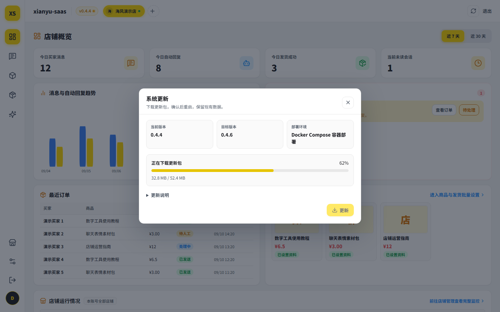
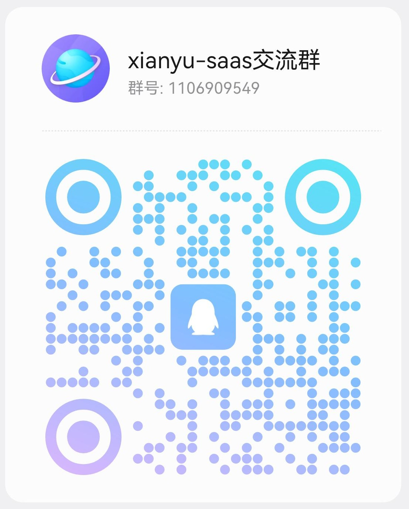

# xianyu-saas

闲鱼多店铺客服与自动发货工作台，支持多店铺隔离运行、智能客服、智能运维、自定义商品知识库、买家会话、自动发货、规则回复、发货管理等功能。

项目适合需要同时管理多个闲鱼账号、处理重复咨询，或销售卡密、兑换码、网盘资料等虚拟商品的卖家。可以只使用关键词回复，也可以接入大模型，让客服结合商品信息和店铺知识回答问题；发货按商品单独配置。

[](LICENSE)

[功能介绍](#功能介绍) · [下载安装](#安装) · [首次使用](#首次使用) · [网页更新](#网页更新) · [更多截图](#更多截图) · [开发与文档](#开发与文档) · [交流与建议](#交流与建议)


## 功能介绍

### 多店铺隔离运行

在「店铺管理」添加账号，使用闲鱼 App 扫码完成接入，再通过顶部店铺切换器查看各店铺的商品、会话、订单和配置。

- 每个店铺由独立进程运行，登录状态、商品缓存、会话记录和配置分别保存。
- 支持修改店铺名称、检测连接状态、重新扫码和断开连接。
- 服务重启或重新授权后可恢复需要运行的店铺；手动停止的店铺保持停止。
- 概览页展示买家消息、自动回复、发货结果、最近订单和待处理事项；列表只保留最近内容，卡片内滚动查看。
- 店铺管理页显示 CPU 占用、内存和运行时间，便于了解多个店铺在服务器上的运行情况。

### 智能客服

在「智能客服中心 → AI 客服设置」填写店铺介绍和客服说明。买家提问时，AI 结合商品资料、自定义知识和对话历史生成回复。

- **客服人设**：提供小喵客服、薄荷客服和自定义人设，直接编辑名称与人设说明。小喵偏软萌机灵，薄荷偏开朗热心；称呼和口吻由当前人设决定。
- **切换即保存**：选择预设后自动保存生效；手动修改名称或说明后，点击「保存并生效」。
- **回复要求**：用自然语言补充店铺的回答方式、售后口径和需要转人工处理的情况。
- **客服模板库**：将当前客服配置保存为命名模板，需要时加载、调整并保存生效。
- **对话沙盘**：使用当前正在编辑的内容试答，查看每个问题的实际回复与所用资料，边调整边预览。
- **统一模型连接**：AI 客服、商品知识整理和店铺助手共用当前用户配置的模型接口。

AI 客服与规则客服分别控制启停。规则开启时先匹配关键词，未命中再由 AI 回答；也可以只启用其中一种。较长的 AI 回复可以拆成短消息依次发送，模型暂时限流或超时会进行有限重试。

### 自定义商品知识库

每件商品可以单独维护客服内容。在「AI 客服设置 → 商品客服内容」选择商品，填写适用人群、规格区别、使用方法、交付说明、售后口径和常见问答。

- 按商品搜索和切换知识内容，分别保存、启用或停用。
- 页面同时展示同步得到的商品标题、价格、库存、状态、简介和规格，方便对照补充说明。
- 粘贴零散说明后，点击「AI 帮我整理」生成建议；采用后继续编辑，再保存到对应商品。
- 店铺说明用于统一客服口径，商品补充内容用于回答具体商品的问题。

### 规则回复

在「智能客服中心 → 规则客服」配置关键词与回复话术，适合价格咨询、使用方法、资料内容等重复问题。

- **商品专属与全店通用规则**：填写商品 ID 时只作用于该商品，留空则作为通用规则；商品专属规则优先匹配。
- **关键词匹配**：一条规则可填写多个关键词，按买家消息是否包含关键词触发回复。
- **规则维护**：支持新增、编辑、启用和停用，直接在规则列表中管理。
- **首次与兜底回复**：纯规则客服可设置首次咨询回复，以及未匹配关键词时的回复内容。
- **回复节奏**：配置基础延迟、随机延迟、触发冷静期、人工接管时间和营业时段。

### 买家会话与人工接管

在「智能客服中心 → 会话工作台」集中查看买家咨询、消息记录和关联商品。

- 按买家或消息搜索会话，筛选未读、人工接管中的对话，并可标记已读。
- 只展示与当前店铺商品相关的买家会话，店主向其他卖家咨询的对话不进入客服列表，也不触发自动客服。
- 有昵称时显示买家昵称，便于区分会话。
- 在当前会话中搜索历史消息，查找之前的沟通内容。
- 管理常用快捷短语，选中后填入回复框。
- 支持上传或直接粘贴图片，一次最多选择 8 张，按顺序排队发送；发送图片时自动接管当前会话。
- 接管后按钮显示「恢复 AI」，再次点击即可恢复自动回复。接管期间其他会话和已核验订单的发货继续运行，也可等待接管时间结束后按店铺配置恢复。

### 商品管理与自动发货

在「商品与发货 → 商品」同步闲鱼商品，查看商品信息和发货配置。支持按名称或商品 ID 搜索、筛选已配置或暂停发货的商品，并切换卡片和列表视图。

订单付款后，系统核对平台订单状态、商品、买家与卖家信息，再按商品配置执行发货。自动发货可以与 AI 客服或纯关键词回复配合使用。

店铺连接后会主动检查平台待发货订单，默认每 5 分钟补查一次，每轮检查 1 页、最多 30 条，用于补上断线或停机期间漏掉的付款通知。补查与实时通知共用发货记录，已完成的订单不会重新分配卡密。退款中、身份不符或未配置发货的订单不自动处理。

自动发货与客服开关独立：只配置发货也可以运行。保存商品发货配置后会尝试启动店铺进程，页面会分别提示资料保存结果和运行状态。

| 发货类型 | 使用方式 |
| --- | --- |
| 卡密与兑换码 | 绑定卡密池，按订单购买数量预留并分配卡密，支持 1–50 件，记录发放状态。 |
| 网盘资料 | 绑定网盘资料，订单核验通过后发送对应内容。 |
| 固定文字 | 保存使用教程或文字资料，支持单件订单自动发送；多件订单进入人工复核。 |

商品可以分别设置资料和发货开关。需要给多个商品使用相同文字资料时，可选中商品批量设置，也可以批量暂停。

### 发货模板与卡密库存管理

「商品与发货」下的「发货模板」和「卡密库存」用于维护发货内容与库存。

- **发货模板**：创建和编辑模板名称、说明与发货话术，关联卡密池并绑定商品；未绑定的模板可先作为草稿保存。
- **卡密池**：按用途建立不同卡密池，填写名称和备注，并分别启用或停用。
- **批量导入**：粘贴卡密文本，每行一条，导入到对应卡密池。
- **库存查看**：查看总库存、可用、预占和已消耗数量，按需要补充卡密。

### 订单管理

在「订单管理」查询订单与发货记录，跟踪从处理中到发货完成的状态。

- 按订单号、商品 ID、买家 ID 和日期查询。
- 按处理中、已发送、待人工、待重试等状态筛选。
- 展开订单查看金额、购买数量、异常原因、发送时间和平台发货时间。
- 从订单跳转到关联买家会话，继续处理咨询或售后问题。

### 智能运维（店铺助手）

进入「智能运维 Agent」，用自然语言管理当前店铺的商品配置。可以连续追问，让助手根据前面的内容继续调整。

- 查询商品及其当前客服、规则和发货配置。
- 为目标商品补充、修改、启用或停用客服知识。
- 新增、修改、启用或停用目标商品的关键词回复规则。
- 为商品绑定已有卡密池或网盘资料，也可将提供的文字设为发货内容。
- 查看每次操作的执行结果，支持停止生成和重试。

例如，可以说“给这个商品补一段使用说明”“停用这个商品的售后关键词规则”，或“把已有的入门资料绑定到这个商品”。

### 模型连接、账号与运行设置

系统设置按用途分为五个页面：

| 页面 | 功能 |
| --- | --- |
| 模型连接 | 设置接口地址、模型名称和 API Key，测试后保存。支持 OpenAI Chat Completions 兼容接口、OpenAI Responses、Claude、Gemini 和 Ollama。 |
| 运行与资源 | 管理员设置每用户可添加店铺数、全局同时运行店铺数和默认单店内存上限。 |
| 账号安全 | 使用当前密码修改自己的登录密码，修改后保留当前会话，退出其他登录会话。 |
| 账号与权限 | 管理员查看用户与会话数量，调整角色、启停账号、解除登录锁定、撤销会话和控制开放注册。 |
| 安全记录 | 管理员查看注册、登录、密码修改、权限变更和版本更新等操作记录。 |

每位用户分别管理自己的店铺与模型连接，同一用户旗下的店铺共用该用户的模型配置。

## 安装

当前正式版为 **[0.4.6](https://github.com/tswawa/xianyu-saas/releases/tag/v0.4.6)**。选择一种部署方式即可。后续维护以 0.4.6 为起点，旧版请升级后使用。

| 部署方式 | 下载 |
| --- | --- |
| Docker（推荐） | [源码安装包](https://github.com/tswawa/xianyu-saas/releases/download/v0.4.6/xianyu-saas-0.4.6-source.zip) |
| Ubuntu x86_64 | [安装器](https://github.com/tswawa/xianyu-saas/releases/download/v0.4.6/xianyu-saas-0.4.6-linux-x86_64) |
| Ubuntu ARM64 | [安装器](https://github.com/tswawa/xianyu-saas/releases/download/v0.4.6/xianyu-saas-0.4.6-linux-aarch64) |

安装请使用上表文件。其他清单与签名由程序处理；GitHub 自动生成的 “Source code” 归档不是这里的源码安装包。

### Docker

需要 Linux Docker Engine 与 Compose 插件。Windows 用户请先启动 Docker Desktop，再在 WSL2 的 Linux 文件系统中运行以下命令。

```bash
VERSION=0.4.6
curl -fLO "https://github.com/tswawa/xianyu-saas/releases/download/v${VERSION}/xianyu-saas-${VERSION}-source.zip"
unzip -q "xianyu-saas-${VERSION}-source.zip"
cd "xianyu-saas-${VERSION}"
sudo bash deploy/docker-install.sh
```

服务器本机访问：`http://127.0.0.1:4173/xianyu-saas/`。业务数据保存在安装目录的 `data/`，配置在 `config/saas.env`。

Docker 默认仅映射本机端口。远程访问、域名与 HTTPS 配置见[部署指南](docs/DEPLOYMENT.md)。重复运行安装脚本只会检查并启动已有容器；网页更新见下方说明。

### Ubuntu 原生安装

支持 Ubuntu 22.04、24.04 和 Debian 12，需要 systemd。根据处理器架构选择 `x86_64` 或 `aarch64`。

```bash
VERSION=0.4.6
ARCH=x86_64  # ARM64 改为 aarch64
curl -fLO "https://github.com/tswawa/xianyu-saas/releases/download/v${VERSION}/xianyu-saas-${VERSION}-linux-${ARCH}"
chmod +x "xianyu-saas-${VERSION}-linux-${ARCH}"
sudo "./xianyu-saas-${VERSION}-linux-${ARCH}" install --version "$VERSION"
```

服务器本机访问：`http://127.0.0.1:8096/xianyu-saas/`。业务数据在 `/var/lib/xianyu-saas`，配置在 `/etc/xianyu-saas.env`。使用 `sudo xianyu-saas status` 查看状态，其他管理命令见[部署指南](docs/DEPLOYMENT.md)。

## 首次使用

### 首次管理员注册

默认全新安装后，直接在网页创建管理员账号：

1. **打开工作台**：Docker 部署在服务器本机访问 `http://127.0.0.1:4173/xianyu-saas/`；Ubuntu 原生安装访问 `http://127.0.0.1:8096/xianyu-saas/`。已配置域名或反向代理时，使用对应的访问地址。
2. **填写账号和密码**：页面显示「创建首个管理员账号」。账号为 3–32 位，以字母或数字开头，可包含字母、数字、下划线、点和短横线；密码为 12–1024 位。
3. **点击「创建管理员并进入工作台」**：系统建立管理员账号、默认店铺和基础配置，然后自动登录。
4. **连接闲鱼店铺**：进入「店铺管理」，选择默认店铺或添加新店铺，用闲鱼 App 扫码完成连接。

首次注册使用自己填写的账号和密码。默认配置 `SAAS_BOOTSTRAP_ENABLED=0` 时，该入口在尚未创建用户且初始化未完成时开放，不受后续普通注册开关限制；首次创建成功后关闭。

若部署时设置了 `SAAS_BOOTSTRAP_ENABLED=1`，则通过一次性令牌完成初始化，具体见[账号与权限说明](docs/ACCESS_MODEL.md)。

### 后续用户注册与权限

后续用户注册默认关闭。需要让其他人注册时：

1. 在部署环境配置中设置 `SAAS_ALLOW_REGISTRATION=1`，并按[部署指南](docs/DEPLOYMENT.md)使配置生效。
2. 管理员进入「系统设置 → 账号与权限」，开启「后台开放注册」。
3. 新用户通过登录页的注册入口创建账号，完成后自动登录。

两个开关同时开启时，普通注册入口才可用。Docker 更改环境配置需要重建容器加载，Ubuntu 原生服务更改环境配置后需要重启。

| 角色 | 可以管理的内容 |
| --- | --- |
| 管理员（admin） | 自己的店铺与业务，以及平台账号、运行资源、注册开关、安全记录和版本更新。 |
| 普通店主（owner） | 自己的店铺、商品知识、买家会话、订单、回复规则、发货资料和模型连接。 |

首个注册账号为管理员，之后自行注册的账号为普通店主。管理员可以在账号列表中调整用户角色、启停账号、解锁登录或撤销登录会话。

### 店铺接入与日常配置

1. **选择店铺**：在「店铺管理」选择已接入的店铺；新增账号时添加店铺并扫码连接。
2. **连接模型**：在「系统设置 → 模型连接」填写接口地址、模型名称和 API Key，测试后保存。只使用关键词回复时，可以直接配置规则。
3. **同步商品**：在「商品与发货 → 商品」点击同步，取得店铺商品列表。
4. **设置智能客服**：在「智能客服中心 → AI 客服设置」填写店铺说明，选择小喵、薄荷或自定义人设，按需编辑人设说明或保存客服模板。
5. **补充商品知识**：选择商品，填写规格区别、使用方式、交付说明和常见问答；需要整理文本时使用「AI 帮我整理」，采用后保存。
6. **配置规则回复**：在「规则客服」添加关键词和回复话术，选择关联商品或设为全店通用，并设置延迟、冷静期和营业时间。
7. **试答并启用客服**：在沙盘中尝试不同问题、调整客服内容，保存配置并开启客服。
8. **准备发货资料**：卡密商品先建立卡密池、批量导入卡密，再创建发货模板并绑定商品；文字资料可在商品中设置，也可由店铺助手绑定已有资源。
9. **查看运行与订单**：在概览页查看待办和运行情况，在会话工作台接管需要人工处理的咨询，在订单与库存页面跟踪发货和余量。

## 网页更新

管理员点击顶部导航栏的版本号即可检查更新。有新版本时：

1. 点击「更新」，等待下载和校验；窗口会显示下载大小与进度。
2. 下载期间可以关闭窗口，后台继续下载，再次打开弹窗可恢复进度展示。
3. 校验完成后输入当前管理员密码确认，程序自动切换版本并重启服务。
4. 显示更新完成后刷新页面，继续使用工作台。



普通代码更新无需重建 Docker 镜像。新版本启动失败时会尝试恢复上一版本；文件更新保留现有业务数据和配置，不自动备份或还原数据库。

已接入内置更新功能的 v0.4.5 可按以上步骤升级到 v0.4.6。升级后不建议降回旧版，旧版无法完整识别本版新增配置。其他旧安装、依赖或数据格式变化时的升级方式，见[部署指南](docs/DEPLOYMENT.md)。

## 更多截图

<details>
<summary>展开查看买家会话、AI 客服、商品与店铺助手</summary>

### 客服与人工接管


### AI 客服与沙盘


### 商品管理


### 店铺助手


</details>

## 开发与文档

项目使用 FastAPI 提供后端服务，前端由 HTML、CSS 和原生 JavaScript 构成。每个店铺通过独立的 Python Worker 连接闲鱼，处理消息、回复规则与发货任务。

在 Linux 或 WSL2 中搭建开发环境：

```bash
git clone https://github.com/tswawa/xianyu-saas.git
cd xianyu-saas
./scripts/bootstrap-dev.sh
npm run dev
```

```text
frontend/   工作台页面、样式与交互
backend/    API、账号管理、AI 客服与任务调度
worker/     闲鱼连接、消息处理与发货
config/     环境配置模板
deploy/     安装脚本与服务配置
scripts/    开发、构建与发布工具
tests/      自动化测试
docs/       部署、使用与架构文档
```

| 需要了解的内容 | 文档 |
| --- | --- |
| 安装、远程访问、配置、备份与旧版迁移 | [部署指南](docs/DEPLOYMENT.md) |
| 用户角色、店铺归属与权限 | [权限说明](docs/ACCESS_MODEL.md) |
| AI 客服、规则与沙盘的工作方式 | [客服说明](docs/AI-CUSTOMER-SERVICE-REQUIREMENTS.md) |
| 本地开发与贡献代码 | [贡献指南](CONTRIBUTING.md) · [Ubuntu 开发环境](docs/NEW_UBUNTU_HANDOFF.md) |
| 进程、数据流与 Worker | [系统架构](docs/ARCHITECTURE.md) · [Worker 说明](worker/README.md) |
| 版本变化与发布维护 | [更新记录](CHANGELOG.md) · [发布指南](docs/RELEASING.md) |
| 漏洞报告与社区协作 | [安全政策](SECURITY.md) · [行为准则](CODE_OF_CONDUCT.md) |

## 交流与建议

对项目有改进建议，或想交流使用经验，欢迎加入 QQ 交流群：**1106909549**。问题与建议请进群向机器人反馈。



## 许可证

项目采用 [GPL-3.0-only](LICENSE) 许可。上游代码与第三方组件说明见 [LICENSING.md](LICENSING.md) 和 [worker/NOTICE.md](worker/NOTICE.md)。
