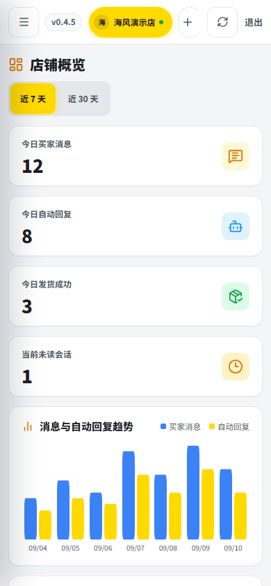
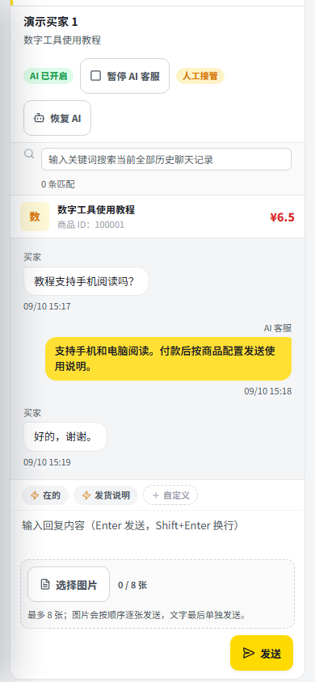
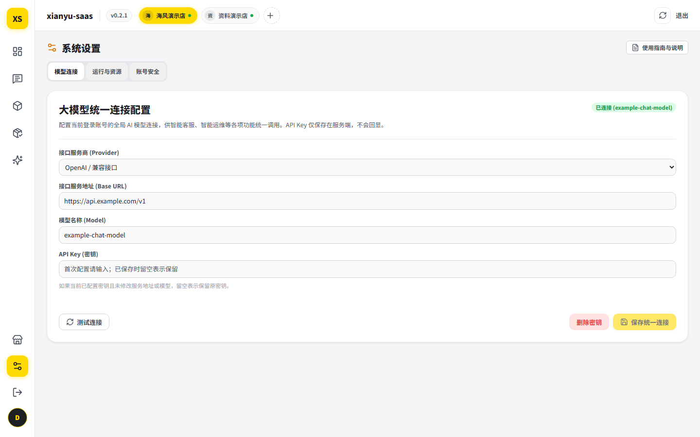
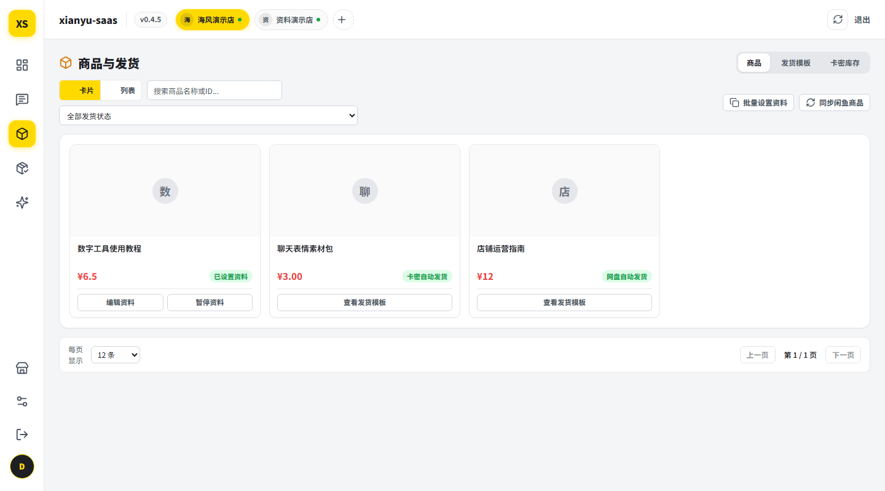
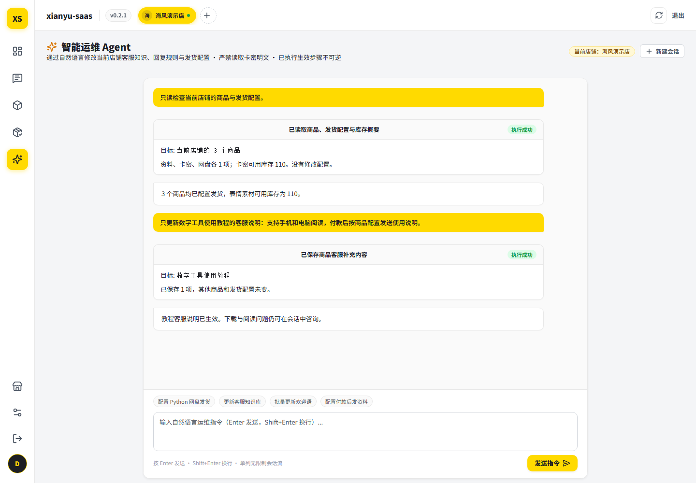
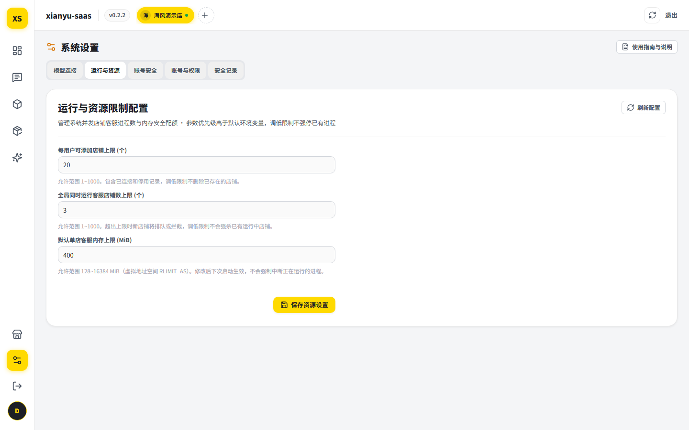

# xianyu-saas

闲鱼多店铺客服工作台与自动化履约系统。提供多账号进程隔离、商品与会话管理、关键词规则与大模型智能客服、虚拟商品自动发货以及基于授权工具的店铺助手。

[](LICENSE)
[](https://www.python.org/)
[](https://nodejs.org/)


*注：文档中展示的界面截图均为本地离线测试环境中的演示数据。*

---

## 功能模块

### 1. 多账号管理与店铺隔离
- 每个闲鱼店铺由独立的 Python Worker 进程承载，各店铺采用独立进程和数据目录，共享宿主资源运行。
- 店铺凭据、商品缓存、会话历史与配置目录独立存放，不同账号数据互不串扰。
- 支持在工作台直接生成闲鱼授权二维码，使用闲鱼移动客户端扫码即可完成店铺登录与会话接入。
- 提供运行状态监控，实时显示各店铺 Worker 进程的 CPU 占用、物理内存（RSS）与运行时间。

### 2. 智能客服与规则引擎
- **双层规则匹配**：支持配置商品专属问答与全店通用问答。买家咨询特定商品时优先命中专属规则，未命中时回退到通用规则。所有规则仅采用关键词包含匹配，无独立的精确或模糊模式。
- **三种匹配策略**：
  - `standard`（标准）：命中首个关键词规则后，按已保存的打字延迟与随机抖动发送回复。
  - `conservative`（保守）：买家发送超过 240 字的长消息时自动跳过规则，交由 AI 客服或人工处理。
  - `aggressive`（激进）：同时命中多条规则时，优先选用关键词较长的话术。
- **节奏控制与时间窗口**：可配置随机打字延迟与消息防刷冷却时间；支持设置营业时间段，非工作时间自动回复处于静默状态（不影响已核验订单的发货履约）。
- **大模型客服引擎**：
  - 支持 OpenAI 兼容接口、Anthropic Claude、Google Gemini 以及 Ollama 协议（本地私网与 HTTP 访问默认关闭，配置例外详见 [DEPLOYMENT.md](docs/DEPLOYMENT.md)）。
  - 自动读取关联商品的标题、价格、简介与规格属性，作为上下文参考。
  - 代码内置敏感词过滤（如站外导流词拦截）、发货与退款承诺拦截（防止模型擅自向买家做出交易承诺），以及重复内容熔断机制。
  - 内置多轮对话沙盘：支持基于未保存草稿快速模拟（标记 `sent: false`，不保存配置、不发闲鱼消息）。客服内容为空或未选商品可基础模拟，买家问题必填，模型连接须有效。正式客服仅要求保存有效店铺客服内容并显式启用（商品补充知识非必填）；沙盘不参与关键词规则与发货履约。
- **人工接管机制**：人工客服在后台发送消息后进入接管保护倒计时，期间暂停该会话的自动回复链；已通过核验的订单履约独立执行，不受人工接管影响。倒计时结束后满足条件时恢复自动回复。支持一次性排队发送最多 8 张图片。

### 3. 虚拟商品自动发货
- **发货类型支持**：
  - 兑换码与卡密池：根据买家拍下件数（支持 1-50 件）自动分配对应数量的可用卡密，使用数据库事务加锁防止重复发放。
  - 网盘资源：待发货订单核验通过且资源配置有效时，下发网盘分享链接与提取码。
  - 固定文字资料：仅支持单件订单自动发送固定的使用教程或文本材料；多件订单自动转入人工复核。
- **双重订单状态核验**：监听到付款通知后，Worker 调用平台订单接口核验订单真实状态（必须处于待发货状态 `status == 2`）、商品 ID、买家 ID 与卖家身份，核验通过后执行发货动作。
- **规则模式履约**：仅使用关键词规则模式时，发货流程同样正常执行，涵盖卡密池分发、网盘链接与固定文本资料发送。
- **模板与卡密状态管理**：未绑定商品的模板处于草稿状态；新导入且未分发的卡密可用于初始绑定；卡密预留具备受控释放分支，已发放或已撤销的卡密不会被二次激活。

### 4. 店铺助手（智能运维）
- 在后台提供基于持久会话的店铺运维助手，针对当前选中的店铺进行配置管理。
- 助手根据对话意图，直接调用受限的店铺配置工具，执行修改问答规则、补充知识条目、调整发货模板等操作。
- 每次工具调用均返回执行回执，界面支持停止生成、重试以及继续追问。
- 工具边界受到严格限制：仅能修改当前店铺的问答知识、回复规则与发货资料，不能执行操作系统 Shell 命令，不能发起退款，不能直接向买家发送消息，不能直接执行实际发货，也不能导出卡密内容。
- **资源配额与权限隔离**：所有用户均可在设置中查看全局运行限制摘要，仅管理员可以修改全局限制；平台管理员也无权跨用户读取店铺业务数据（Cookie、订单、买家会话与知识库）。

---

## 界面预览

### 工作台概览与移动端适配

*工作台桌面概览*


*移动端自适应概览*

### 店铺管理与会话工作台

*店铺矩阵管理与独立 Worker 状态*


*买家咨询列表与人工实时接管工作台*


*移动端客服会话界面*

### 智能客服与统一模型设置

*店铺 AI 客服人设、知识库条目与多轮对话沙盘*


*用户统一模型连接配置与服务商连通性测试*

### 商品与发货履约

*在售商品同步与发货资料绑定状态*


*虚拟卡密池管理与库存使用统计*


*平台订单同步与自动发货状态跟踪*

### 店铺助手与全局限制设置

*店铺助手对话配置与工具调用回执*


*管理员全局运行限制设置（Worker 进程 CPU 与物理内存实时监控见概览页）*

---

## 快速上手

项目提供两种生产部署方式：**Docker 部署（推荐）** 与 **Ubuntu 原生安装（支持 x86_64 与 ARM64）**。

请从官方 [GitHub Releases](https://github.com/tswawa/xianyu-saas/releases) 下载固定版本的发布文件，普通用户无需使用 Git 克隆开发分支：

| 部署方式 | 适用环境 | Release 下载入口 |
| --- | --- | --- |
| Docker 部署（推荐） | Linux 服务器、Docker Desktop + WSL2 | `xianyu-saas-<version>-source.zip` |
| Ubuntu 原生安装（x86_64） | Ubuntu 22.04 / 24.04、Debian 12（x86_64） | `xianyu-saas-<version>-linux-x86_64` |
| Ubuntu 原生安装（ARM64） | Ubuntu 22.04 / 24.04、Debian 12（ARM64） | `xianyu-saas-<version>-linux-aarch64` |

> 提示：推荐下载项目发布的 `xianyu-saas-<version>-source.zip`。它包含构建元数据并与签名清单绑定；GitHub 自动打包的 Source code 不包含发布构建信息。其余清单与签名附件由安装程序和更新器自动调用，无需手动下载。

### 方式一：Docker Compose 部署（推荐）

该方式适用于 Linux 服务器或 Windows 下的 Docker Desktop（需在 WSL2 Linux 文件系统中运行）。系统需具备 `curl`、`unzip`，以及支持 Engine API v1.47 的 Linux Docker Engine 与 Compose 插件。

安装脚本在本地根据源码构建镜像，不提供预构建镜像，也不从公开镜像仓库拉取业务镜像。

```bash
# 1. 从 GitHub Releases 下载版本化源码包（请将 <version> 替换为实际发布的版本号）
curl -fLO https://github.com/tswawa/xianyu-saas/releases/download/v<version>/xianyu-saas-<version>-source.zip

# 2. 解压并进入解压目录
unzip -q xianyu-saas-<version>-source.zip
cd xianyu-saas-<version>

# 3. 执行安装脚本
sudo bash deploy/docker-install.sh
```

- **访问地址**：`http://127.0.0.1:4173/xianyu-saas/`
- **数据目录**：SQLite 数据库、店铺配置与主密钥保存在 `./data` 目录；内置更新器的代码存储在 `./data/app-code`，基础运行环境与可信公钥固定在容器镜像内。
- **环境要求**：必须在本地 Linux 或 WSL2 Linux 文件系统中执行，不支持在 Windows PowerShell 或 Git Bash 中直接运行。在 Windows 上使用时，请安装 Windows 版 Docker Desktop 并启用 Linux 容器模式，在 WSL2 的 Linux 文件系统路径中下载解压并运行。Worker 及控制面依赖 Linux 内核接口（如 `fcntl`、`/proc`、`RLIMIT_AS`、`setsid` 等），不支持 Windows 原生直接运行全部服务。
- **重复执行**：脚本具备幂等性。检测到已运行的容器后，仅校验并启动既有容器（`docker start` 保留原镜像与配置），不会重新构建镜像，也不会替换或自动迁移旧镜像；修改环境变量或 Compose 配置后，`docker start` 不会加载新配置，需由维护者人工重建容器；旧版未接入内置启动器的 Docker 容器无法通过重新运行脚本自动迁移。

查看应用日志、暂停应用与恢复：
```bash
sudo docker logs -f xianyu-saas
sudo docker stop xianyu-saas
sudo bash deploy/docker-install.sh
```

- **网页更新**：管理员打开版本信息，点击「更新」；下载并校验完成后输入管理员密码确认，随后自动重启服务。现有业务数据与配置会保留，详情见 [`docs/DEPLOYMENT.md`](docs/DEPLOYMENT.md)。

### 方式二：Ubuntu 原生安装（x86_64 / ARM64）

适用于直接使用 systemd 管理服务的 Ubuntu 22.04、24.04 或 Debian 12 系统。系统需具备 `systemd`、`systemd-analyze`、`useradd` 以及用于下载的 `curl`。

下载对应系统架构的管理器文件（无后缀可执行文件），择一执行：

```bash
# x86_64 架构：
curl -fLO https://github.com/tswawa/xianyu-saas/releases/download/v<version>/xianyu-saas-<version>-linux-x86_64
chmod +x xianyu-saas-<version>-linux-x86_64
sudo ./xianyu-saas-<version>-linux-x86_64 install --version <version>

# ARM64 架构：
curl -fLO https://github.com/tswawa/xianyu-saas/releases/download/v<version>/xianyu-saas-<version>-linux-aarch64
chmod +x xianyu-saas-<version>-linux-aarch64
sudo ./xianyu-saas-<version>-linux-aarch64 install --version <version>
```

- **访问地址**：`http://127.0.0.1:8096/xianyu-saas/`
- **数据与配置**：数据保存在 `/var/lib/xianyu-saas`，配置文件位于 `/etc/xianyu-saas.env`，更新代码保存在 `/var/lib/xianyu-saas/app-code`。
- **系统服务与更新**：安装后由 systemd 与内置启动器运行；同样支持点击「更新」，下载并校验后输入密码确认重启。详情见 [`docs/DEPLOYMENT.md`](docs/DEPLOYMENT.md)。
- **日常维护**：安装完成后直接使用系统已注册的管理器命令进行维护：
  ```bash
  sudo xianyu-saas status
  sudo xianyu-saas restart
  sudo xianyu-saas doctor
  ```
- **说明**：管理器是引导安装程序，执行时下载并校验签名运行包。原生安装事务会备份数据库；网页文件更新仅保留现有数据，不另做数据库备份。

### 源码开发指南（仅限开发者）

适用于需要修改后端或前端源码的开发者：

```bash
git clone https://github.com/tswawa/xianyu-saas.git
cd xianyu-saas

# 初始化 Python 虚拟环境与前端开发环境
./scripts/bootstrap-dev.sh

# 启动全栈开发服务
npm run dev
```

详细本地开发指南参见 [`docs/NEW_UBUNTU_HANDOFF.md`](docs/NEW_UBUNTU_HANDOFF.md)。

---

## 首次使用与管理员注册

系统默认配置（`SAAS_BOOTSTRAP_ENABLED=0`）首次创建管理员流程如下：

1. **注册首位管理员**：首次启动后，访问 `http://127.0.0.1:4173/xianyu-saas/`（Docker）或 `http://127.0.0.1:8096/xianyu-saas/`（Ubuntu 原生），数据库为空时页面会自动显示「创建首个管理员账号」。在此处填写管理员用户名并设置不少于 12 位的密码。该首次注册不受 `SAAS_ALLOW_REGISTRATION=0` 的限制。
2. **初始化数据**：提交后创建管理员账号、默认店铺与基础配置。支持接纳空目录与纯默认残留，拒绝已有业务数据或损坏配置，接入并发回滚保护。权限边界保持独立不变。初始化成功后自动登录。
3. **安全提示**：空数据库允许首次访问者创建管理员。在将服务公开暴露到公网之前，必须先在本地或受信网络中完成首位管理员注册。
4. **后续注册限制**：首位管理员创建完成后，后续公开注册默认关闭。若需允许其他用户注册，必须在环境变量中设置 `SAAS_ALLOW_REGISTRATION=1`，同时在工作台系统设置中打开注册开关。

如果运维显式配置了 `SAAS_BOOTSTRAP_ENABLED=1`，系统将转为令牌引导模式，此时必须通过受信任来源和令牌文件进行初始化。具体规则见 [`docs/ACCESS_MODEL.md`](docs/ACCESS_MODEL.md)。

---

## 日常配置流程

1. **登录与绑定店铺**：使用管理员账号登录工作台，进入「店铺管理」页面，点击添加店铺，使用手机端闲鱼 App 扫描屏幕二维码完成店铺接入。扫码前校验真实冷却并预留有限租约，倒计时期间禁用重复操作；扫码确认后会话有效期为 90 秒，新 Cookie 验证通过后方才替换旧连接。
2. **配置统一模型连接**：在「系统设置 → 模型连接」页面输入大模型服务商的 API 地址、模型 ID 与 API Key。点击测试连接，确认可用后保存。该连接归属当前登录用户，供该用户旗下的所有店铺共用。
3. **准备客服知识与沙盘验证**：在「智能客服」页面配置客服回复风格、客服称谓与营业时间。在知识库中添加常见问答，或粘贴宝贝说明使用知识提炼功能生成条目。右侧沙盘可直接使用未保存草稿输入提问检查效果（沙盘标记 `sent: false`，不发送真实消息、不改变线上配置，模型连接需保持有效；正式生效需保存并开启客服）。
4. **添加关键词回复规则**：针对高频问题配置包含匹配的关键词规则，设置命中后的回复文本与随机延迟。
5. **配置发货模板与库存**：进入「履约中心」，创建发货模板并录入网盘链接或导入卡密数据。将模板绑定到对应商品，开启自动发货开关。

---

## 常用环境变量

可在 `config/saas.env` 中调整以下核心运行参数：

| 环境变量名 | 说明 | 默认值 / 示例 |
| --- | --- | --- |
| `SAAS_PUBLIC_ORIGIN` | 浏览器访问工作台的完整来源（协议、域名与端口） | `http://127.0.0.1:4173` |
| `SAAS_COOKIE_SECURE` | 会话 Cookie 是否标记 Secure 属性（HTTPS 环境应设为 1） | `0`（本地测试）/ `1`（生产） |
| `SAAS_AI_MASTER_KEY` | 用于加密存储模型 API Key 的服务端主密钥（32 字节随机值做标准 Base64 编码，编码后长度 44 字符） | 可通过 `python3 -c "import secrets, base64; print(base64.b64encode(secrets.token_bytes(32)).decode())"` 生成 |
| `SAAS_MAX_BOTS` | 允许同时运行的最大店铺 Worker 数量（模板示例设为 3；代码缺省回退为 15，数据库保存设置可覆盖环境值） | `3` |
| `SAAS_ALLOW_REGISTRATION` | 是否允许后续公开注册的布尔开关（0 为关闭，1 为允许；需配合系统设置开启） | `0` |

完整配置项与说明请参考 [`config/saas.env.example`](config/saas.env.example)。

---

## 目录结构

```text
frontend/             前端静态单页应用（HTML、CSS 与原生 JavaScript）
backend/              FastAPI 后端服务、AI 客服引擎与任务调度
worker/               闲鱼长连接接入、消息规则处理与发货状态机进程
config/               环境变量配置模板
deploy/               Nginx、systemd 服务配置模板
scripts/              本地开发初始化与调试脚本
tests/                自动化回归测试与合规性检查脚本
docs/                 部署指南、权限模型与系统架构设计文档
```

---

## 相关文档

### 安装与部署
- [`docs/DEPLOYMENT.md`](docs/DEPLOYMENT.md)：生产环境部署指南（Docker Compose 与 systemd 守护进程）。
- [`docs/ACCESS_MODEL.md`](docs/ACCESS_MODEL.md)：账号角色、数据隔离与权限边界说明。
- [`docs/NEW_UBUNTU_HANDOFF.md`](docs/NEW_UBUNTU_HANDOFF.md)：Ubuntu / Debian 源码开发环境搭建指南（仅限开发者）。

### 架构与开发
- [`docs/ARCHITECTURE.md`](docs/ARCHITECTURE.md)：系统架构设计、进程模型与数据流说明。
- [`docs/AI-CUSTOMER-SERVICE-REQUIREMENTS.md`](docs/AI-CUSTOMER-SERVICE-REQUIREMENTS.md)：AI 客服工程实现规范与上下文结构。
- [`worker/README.md`](worker/README.md)：Worker 消息接入、发货状态机与协议运行时说明。
- [`CONTRIBUTING.md`](CONTRIBUTING.md)：代码贡献规范与本地回归测试门禁。
- [`.github/PULL_REQUEST_TEMPLATE.md`](.github/PULL_REQUEST_TEMPLATE.md)：Pull Request 提交模板与自查清单。

### 版本与发布
- [`CHANGELOG.md`](CHANGELOG.md)：版本变更与发布历史记录。
- [`docs/PUBLIC_RELEASE_CHECKLIST.md`](docs/PUBLIC_RELEASE_CHECKLIST.md)：开源发布前检查清单。
- [`docs/RELEASING.md`](docs/RELEASING.md)：版本发布与构建维护指南。

### 社区与安全规范
- [`SECURITY.md`](SECURITY.md)：安全政策与漏洞提报途径。
- [`CODE_OF_CONDUCT.md`](CODE_OF_CONDUCT.md)：开源社区行为准则。
- [`LICENSING.md`](LICENSING.md)：代码许可证说明与依赖许可证合规清单。
- [`worker/NOTICE.md`](worker/NOTICE.md)：Worker 组件上游代码来源与版权声明。

---

## 免责声明

本项目为一个独立的第三方店铺管理工具，仅用于自用店铺的日常运维与学习研究，与阿里巴巴集团或闲鱼官方无商业关联。使用者应遵守相关法律法规及第三方平台服务协议，合理设置请求频次，自行承担使用过程中的账户与业务风险。

## 许可证

本项目基于 [GPL-3.0-only](LICENSE) 许可证发布。`worker/` 目录中包含的上游代码来源与说明详见 [`worker/NOTICE.md`](worker/NOTICE.md)。
