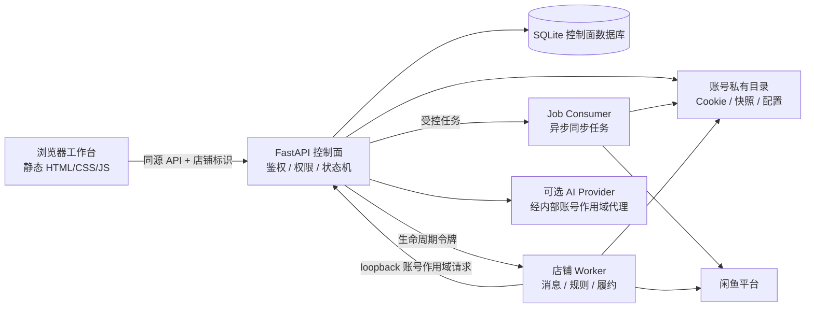

# 架构概览

本项目是一个单仓库、分进程、按店铺账号隔离的闲鱼客服工作台。前端保持静态和轻量，业务状态由 FastAPI 控制面负责，消息与履约由独立 Worker 负责。

## 数据流

## 组件边界

### `frontend/`

纯静态工作台，不保存 Cookie、Token 或长期模型密钥；用户主动测试或保存模型连接时，Key 只短暂存在页面内存并提交给服务端，应用不写入浏览器存储。账号切换、商品切换和异步请求使用 generation/scope 保护迟到响应，但后端仍是最终权限边界。

### `backend/`

FastAPI 控制面负责：

- 会话鉴权、权限和六个业务域的 API；
- 官方二维码登录、店铺同步和状态机；
- SQLite jobs、leases、worker 期望状态和审计摘要；
- 账号私有文件初始化、配置校验和敏感字段过滤；
- 账号作用域的内部 AI 请求和 provider 连接。

### `worker/`

每个店铺账号一个受控进程，负责 WebSocket 入站、规则/AI 回复、人工回复 outbox 和订单证明后的履约。自动发货不能由买家文字、商品标题或模型输出授权，必须依赖平台订单证明和事务库存预留。

### `backend/job_consumer.py`

独立单写者消费异步店铺同步任务。任务载荷不保存 Cookie 原文，使用账号作用域和短期租约，失败进入有界重试或死信状态。

### `deploy/`

提供 nginx、systemd 和日志轮转模板，用于版本化 release 加独立 updater 的生产部署。模板中的路径、域名和密钥均应由部署者在目标环境明确配置，不能把本机运行态复制进 Git。

### 根目录容器化

`Dockerfile`、`docker-compose.yml` 和 `docker/entrypoint.sh` 提供整站单容器运行方式，用于开发与自托管。控制面在容器内派生 Worker 子进程并校验解释器真实路径，因此 backend 与 worker 必须位于同一镜像，且保持 `<SAAS_BOT_ROOT>/.venv/bin/python` 布局。该方式与 `deploy/` 的版本化发布互斥：容器内不使用 `current` 符号链接切换，签名更新链路只适用于 systemd 部署。

### 平台依赖

控制面依赖 Linux 特性实现店铺隔离：`resource.setrlimit(RLIMIT_AS)` 配合 `preexec_fn` 限制单个 Worker 地址空间；`/proc/<pid>/stat` 与 `/proc/<pid>/environ` 校验进程身份，防止 PID 重用误杀或误接管；`fcntl.flock` 保证单个控制面数据库只有一个 API supervisor。这些接口在 Windows 上不存在，因此非 Linux 平台通过容器运行。

## 关键一致性规则

1. 所有可写数据都绑定 `user_id + account_id/account_key`。
2. 控制文件缺失或损坏时 fail-closed；只有显式注册/新建店铺初始化可以播种默认文件。
3. 生成回复发送前必须再次验证自动化开关、AI 状态和配置版本。
4. 平台 ACK 只表示平台协议接收，不等同于买家已读或最终送达。
5. 真实账号、真实订单、真实模型和生产部署属于单独的受控验收，不由离线合同代替。

## 代码导航

| 目标 | 入口 |
| --- | --- |
| API 路由与安全中间件 | `backend/app.py` |
| 数据库 schema、jobs、leases | `backend/db.py` |
| Worker 进程监督 | `backend/bot_manager.py` |
| 异步同步消费 | `backend/job_consumer.py` |
| AI 内容模型与 provider | `backend/ai_customer_service.py`、`backend/ai_provider_adapters.py` |
| 消息与履约 | `worker/main.py`、`worker/context_manager.py`、`worker/delivery_store.py` |
| 前端状态与请求作用域 | `frontend/assets/app.js` |
| 整站容器运行 | `Dockerfile`、`docker-compose.yml`、`docker/entrypoint.sh` |
| 生产发布与原子切换 | `deploy/systemd/`、`deploy/updater/updater.py` |
| 离线合同与浏览器验收 | `tests/`、`worker/tests/` |
