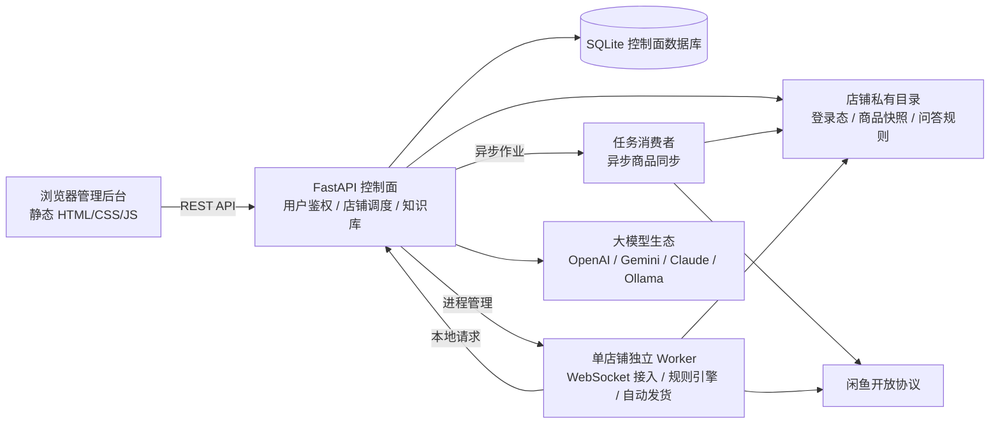

# 系统架构概览

xianyu-saas 是一个单仓库、多进程、按用户与店铺进行物理隔离的闲鱼多店铺运营工作台。

前端保持轻量静态交互，FastAPI 控制面负责鉴权与业务调度，独立 Worker 进程负责各店铺的消息接入与自动发货。

## 整体数据流

## 核心组件划分

### 1. `frontend/`（管理工作台前端）
- 轻量纯原生单页应用（HTML5 + 原生 CSS + 现代 ES 模块），无冗余打包体积；
- 提供运营概览、店铺管理、多店铺切换、客服会话工作台、AI 知识库与沙盘配置、卡密库存池、订单及发货记录；
- 前端不接触大模型长期密钥与闲鱼 Cookie，保障密钥安全。

### 2. `backend/`（FastAPI 控制面）
- 用户身份鉴权、角色权限控制与店铺多租户隔离；
- 店铺官方扫码连接驱动与商品周期性同步调度；
- AI 统一上下文组装、模板管理与 5 种大模型协议适配；
- 持久化人工回复 Outbox，支持图文按序发送；
- 平台系统更新器与健康检查（`/health`、`/api/ready`）。

### 3. `worker/`（单店铺独立 Worker 进程）
- 每个绑定的闲鱼店铺由一个专属 Python Worker 进程常驻驱动；
- **WebSocket 长连接入站**：接收买家即时聊天消息与平台订单付款事件；
- **入站去重与幂等处理**：防重复消费、防重发；
- **客服回复引擎**：执行商品专属与店铺通用规则匹配；未命中时请求控制面 AI 决策；
- **自动发货状态机**：监听付款事件 -> 调用官方双接口验单 -> 事务锁定卡密库存 -> 自动私信下发卡密或网盘资源。

### 4. `deploy/` & 容器编排
- 根目录 `Dockerfile` 与 `docker-compose.yml`：提供开箱即用的一键容器化运行能力，数据外挂在本地 `./data` 目录；
- `deploy/`：针对 Linux 生产环境提供基于 systemd 的守护进程配置、Nginx 反向代理模板与 Ed25519 签名更新器。

## 关键设计准则

1. **店铺强隔离**：各店铺的配置、快照、订单数据保存在独立的物理目录，Worker 独立运行，互不干扰；
2. **发货与 AI 彻底解耦**：大模型仅做客服聊天，发货完全交由双接口验单和原子库存扣减，杜绝模型幻觉导致误发；
3. **真人仿真打字**：支持配置随机 0~60 秒的拟人回复延迟，大幅降低平台风控几率；
4. **人工接管优先**：人工在工作台介入后触发静默冷却，防止机器人与客服争抢插话。
