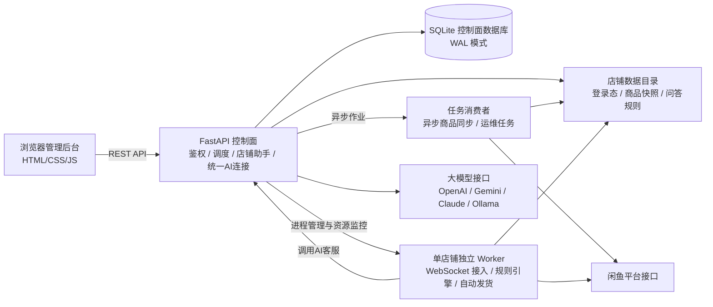

# 系统架构说明

xianyu-saas 是面向闲鱼店铺日常运营的单机自托管工作台，采用多进程架构，按用户与店铺账号进行数据隔离与权限隔离。

前端为原生轻量单页应用，FastAPI 控制面负责鉴权、业务调度、AI 连接与任务分发，独立 Worker 进程负责各店铺的消息接入与自动发货。

## 整体数据流

## 核心组件划分

### 1. 前端工作台 (`frontend/`)
- 基于原生 HTML5、CSS 与 ES 模块开发，不依赖打包工具；
- 页面划分为六大视图：
  - **店铺概览**：展示店铺连接状态、今日买家消息数、今日自动回复数、今日发货成功数与当前未读会话数指标，展示运行情况卡片与待办事项（首页已移除冗余快捷入口与待办空态对勾，优化运行情况卡片标题、作用域标签及窄屏响应式排版）；
  - **商品与发货**：支持卡片与列表双视图切换，管理商品快照、发货模板与卡密库存；
  - **客服工作台**：集中呈现买家会话，支持人工介入与多图有序回复队列；
  - **店铺助手**：针对所选店铺提供持续多轮对话的自动化运维支持；
  - **订单与记录**：展示平台订单核验记录与发货审计跟踪；
  - **店铺管理与设置**：管理多店铺绑定、统一大模型连接、系统资源设置与账号管理；
- 浏览器端维护工作台会话 Cookie；用户在设置界面输入并提交大模型 API Key，浏览器端后续不回显明文且不进行长期本地缓存；大模型 Key 在服务端通过 AES-GCM 加密存储，闲鱼平台 Cookie 保存在服务端私有目录中并受文件系统权限保护。

### 2. 控制面服务 (`backend/`)
- **用户鉴权与多租户权限**：采用 PBKDF2 密码哈希与会话令牌，按用户账号与店铺范围隔离数据访问；
- **首次管理员初始化与用户注册**：默认在 `SAAS_BOOTSTRAP_ENABLED=0` 且数据库无用户时，允许通过网页直接注册首位管理员；布尔开关 `SAAS_ALLOW_REGISTRATION=0` 不限制该首次注册。显式设置 `SAAS_BOOTSTRAP_ENABLED=1` 时，必须通过一次性服务端令牌引导初始化；后续注册受布尔开关 `SAAS_ALLOW_REGISTRATION=1` 与后台管理开关双重控制。两入口均支持补齐空目录与纯默认配置残留，严格拒绝业务数据、未知/损坏/非默认配置及符号链接，接入并发回滚保护（仅清理本次新建且未被认领的目录；SQLite 事务串行化，已有事务或数据库异常时保守保留）；
- **统一模型连接**：大模型连接配置由用户在系统设置中统一维护（`/api/settings/ai/connection`）。服务端要求通过环境变量 `SAAS_AI_MASTER_KEY` 提供 32 字节随机二进制经标准 Base64 编码（编码后长度 44 字符，非 32 字符纯文本，示例：`base64.b64encode(os.urandom(32)).decode()`）的主密钥，以 AES-GCM 加密存储凭据。该连接供该用户下各店铺的 AI 客服、知识整理与店铺助手共用，适配 OpenAI 兼容、OpenAI Responses、Anthropic Messages、Google Gemini 与 Ollama 协议；上游模型返回 401/403 等鉴权异常时，通过非本站 401 错误包装返回，避免前端误将大模型错误判定为系统登录过期；失败后操作按钮恢复可用，历史请求不污染后续新会话；
- **店铺助手（Operations Agent）**：通过 `/api/ops/*` 提供基于会话的运维能力。通过受限工具集直接执行已授权的配置变更，支持执行回执记录、步骤取消、失败可重试恢复与追问确认。店铺助手禁止执行一切真实发货动作，禁止向买家发送任何消息，不执行 shell 命令，不导出卡密明文；
- **并发控制与扫码租约**：基于 SQLite WAL 模式与控制租约（`control_leases`），防止并发修改产生冲突。扫码接入前核验真实冷却并预留有限连接租约，后台旧会话检测延后执行，临时等待不消耗失败重试预算；前端倒计时禁用重复提交，归零不自动发起连续请求；扫码确认后会话有效期默认 90 秒（属于有效期，区别于冷却时间），店铺同步默认冷却（`sync_cooldown`）为 60 秒，本地风险保护（`risk_cooldown`）为 600 秒熔断（本地限频，不代表平台实际解封时间，避免两类冷却混淆）；新 Cookie 验证通过后方才替换旧连接；
- **进程管理与恢复**：调度和管理店铺 Worker 进程，在满足 Linux 内核能力与进程启动时间校验前提下，利用 `pidfd` 机制接管已有 Worker 进程（`bot_manager.adopt`），结合数据库运行时 CAS 机制（`worker_runtimes`）防止进程状态冲突。通过 `/proc` 采集各 Worker 运行时状态（CPU 占用基于单核比例换算、RSS 物理内存、地址空间上限 `RLIMIT_AS`）。单 Worker 地址空间默认上限为 400 MiB；并发运行上限初始默认来自 `SAAS_MAX_BOTS`，管理员已保存的数据库并发配置优先生效；单用户店铺数量默认上限为 20（支持在数据库设置中按需调整）。调低资源上限不会强制终止已有进程或删除店铺，新上限在下次启动时生效；
- **任务队列与商品同步**：基于 SQLite WAL 模式实现持久化异步任务队列，支持任务租约（`control_leases`）、指数退避重试与死信隔离。商品快照由用户在工作台主动触发请求后生成后台任务，由消费者异步执行拉取并落盘；
- **卡密保存补偿写入**：卡密（`redeem_codes.json`）与卡池（`card_pool.json`）保存采用补偿写入上下文（`AccountStorage.compensating_write`）。捕获写入异常时自动恢复旧快照或清理本次新建文件；若补偿恢复失败抛出 `AccountStorageRecoveryError`（HTTP 503）提示人工核对，防止部分写入破坏状态；
- **多媒体人工回复队列**：人工客服回复支持文本与最多 8 张图片排队发送，逐段确认平台 ACK，失败时仅重试未送达部分。

### 3. 店铺 Worker (`worker/`)
- 每个启用的店铺账号由独立的 Python 进程承载，受控制面监管；
- **长连接接入**：维护 WebSocket 连接，接收即时聊天消息与订单状态事件；
- **客服引擎与回复控制**：优先匹配商品专属规则与全店通用关键词规则。未命中且满足条件时，调用控制面接口请求大模型生成回复。回复发送受已配置的拟人随机延迟、营业时间及会话状态约束；
- **人工接管隔离**：工作台人工介入仅抑制当前买家会话的自动回复链，避免与人工抢话；人工接管不影响其他买家会话，亦不暂停店铺已核验订单的发货流程；
- **独立自动发货核验**：自动发货为独立履约流程，不受人工接管或客服营业时段限制。系统在接收到订单付款事件后，调用平台 `HeadInfo` 与 `OrderDetail` 双接口核验买家、卖家、商品及待发货状态（`status == 2`）。固定文字资料仅支持单件发货，网盘资料下发共享链接，仅卡密类型在本地事务中锁定并扣减库存。发货遇到异常根据类型记录为重试、待人工处理等对应状态；
- **平台交互状态细分**：区分 `risk_control`（请求受限保持保护）、`verification_required`（平台安全验证）、`sync_cooldown`（店铺同步冷却 60 秒）与 `risk_cooldown`（本地 600 秒风控保护熔断）。

### 4. 存储与数据隔离
- 控制面数据存储于 SQLite 数据库，采用 WAL 模式提升并发读写性能；
- 各店铺的登录态凭证、商品快照与自定义规则保存在独立的数据目录中，受文件系统权限保护；
- 任务队列持久化在数据库中，支持崩溃恢复、租约超时重领与重试机制。

### 5. 部署与运行环境
- 系统的完整运行依赖 Linux 内核接口（特别是 Worker 进程管理、Linux `/proc` 资源采样、`pidfd`、`fcntl`、`setsid` 与 `RLIMIT_AS` 地址空间限制）；
- 两种生产部署方式：**Docker Compose（推荐）** 与 **Ubuntu 原生安装（支持 x86_64 与 ARM64/aarch64 架构，适用于 Ubuntu 22.04、24.04 及 Debian 12）**；
- Windows 宿主机通过 Docker Desktop 搭配 WSL2 的 Linux 文件系统运行完整后端，不支持 Windows 原生直接运行全部服务。

### 6. 版本探测与平台更新架构
- **低频版本探测协调**：由服务端 `update_probe.py` 协调，默认每 6 小时（`SAAS_UPDATE_CHECK_INTERVAL_SECONDS=21600`）异步查询一次发布源。采用全站共享数据库缓存与租约机制，防止多标签页与多用户重复发起外部请求；网页前端仅在可见时每 5 分钟读取本地版本缓存并驱动徽标提示，探测过程不执行静默下载或安装；
- **默认内置文件更新架构（推荐）**：
  - 核心模块由 `backend/file_update.py` 与监督启动器 `docker/launcher.sh` 构成，默认随 Docker 容器及 Ubuntu 原生部署启动，无需手动组装或登记独立更新器；
  - **存储隔离边界**：可写代码存储与业务数据、基础环境隔离：Docker 代码存储在 `/data/app-code`（映射宿主机 `./data/app-code`），Ubuntu 代码存储在 `/var/lib/xianyu-saas/app-code`；数据库、租户配置、主密钥以及底层 Python 运行环境与公钥固定在可写代码存储之外；
  - **网页更新与进程切换**：管理员在网页确认升级后，后台下载 GitHub Releases 官方签名源码包，使用只读的受信公钥核验数字签名，检查 `UPDATE_DATA_VERSION` 与依赖兼容性（不兼容在停服前拒绝）；启动器停止原进程、原子切换 `current` 软链接至新版本并重启服务，核验 `/health`；普通代码更新不重新构建 Docker 镜像；
  - **健康检查与回滚机制**：新版本启动失败或健康检查超时，启动器自动回滚软链接至上一版本并重启恢复；回滚仅针对应用代码软链接，不触碰亦不回滚业务数据库；
  - **运行环境变更升级**：当遇到依赖或底层环境变动时，内置更新器在停服前拒绝升级，由维护者重新运行官方安装入口（`docker-install.sh` 或管理器 `install`）完成镜像重建或独立运行时刷新；
- **历史独立更新器兼容**：早期版本的独立更新器组件（`docker-compose.updates.yml` 与 systemd 独立更新服务）代码保持向后兼容，但不作为新手默认路径；
- **当前验收状态与边界**：
  - 已完成验证：实际 SaaS Docker 构建安装、就绪验收、静态资源服务、运行中脚本重跑、停止后恢复，以及基于签名源码包的真实 Docker 容器网页升级与数据保留（保留既有配置与业务数据），启动失败自动回退；
  - 发布状态：上述默认内置文件更新与启动器机制**尚未正式对外发布**（已有公开包 0.4.4 与 0.4.5-update-test.1 不包含此机制）；真实线上闲鱼店铺与订单、旧版直装实例的数据迁移，以及线上正式 Release 在浏览器中的端到端点击升级仍待随正式版发布验收。
