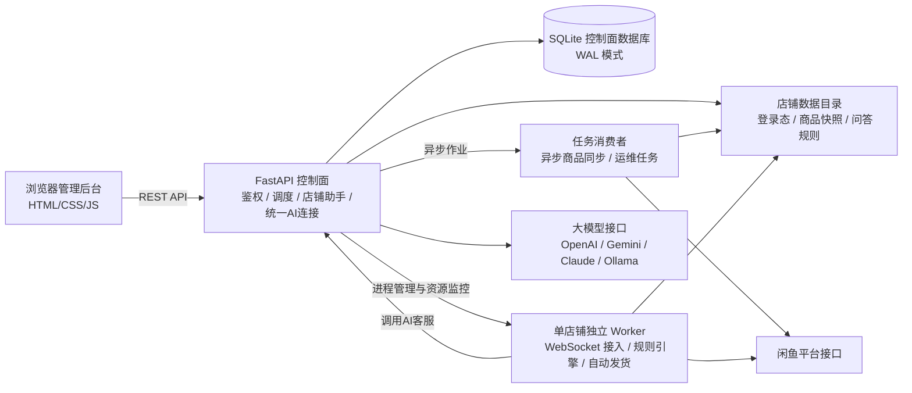

# 系统架构说明

xianyu-saas 是面向闲鱼店铺日常运营的单机自托管工作台，采用多进程架构，按用户与店铺账号进行数据隔离与权限隔离。

前端为原生轻量单页应用，FastAPI 控制面负责鉴权、业务调度、AI 连接与任务分发，独立 Worker 进程负责各店铺的消息接入与自动发货。

## 整体数据流

## 核心组件划分

### 1. 前端工作台 (`frontend/`)
- 基于原生 HTML5、CSS 与 ES 模块开发，不依赖打包工具；
- 页面划分为六大视图：
  - **店铺概览**：展示店铺连接状态、今日买家消息数、今日自动回复数、今日发货成功数与当前未读会话数指标，展示运行情况卡片与待办事项（首页已移除冗余快捷入口与待办空态对勾，优化运行情况卡片标题、作用域标签及窄屏响应式排版）；
  - **商品与发货**：支持卡片与列表双视图切换，管理商品快照、发货模板与卡密库存；
  - **客服工作台**：集中呈现买家会话，支持人工介入与多图有序回复队列；
  - **店铺助手**：针对所选店铺提供持续多轮对话的自动化运维支持；
  - **订单与记录**：展示平台订单核验记录与发货审计跟踪；
  - **店铺管理与设置**：管理多店铺绑定、统一大模型连接、系统资源设置与账号管理；
- 浏览器端维护工作台会话 Cookie；用户在设置界面输入并提交大模型 API Key，浏览器端后续不回显明文且不进行长期本地缓存；大模型 Key 在服务端通过 AES-GCM 加密存储，闲鱼平台 Cookie 保存在服务端私有目录中并受文件系统权限保护。

### 2. 控制面服务 (`backend/`)
- **用户鉴权与多租户权限**：采用 PBKDF2 密码哈希与会话令牌，按用户账号与店铺范围隔离数据访问；
- **首次管理员初始化与用户注册**：默认在 `SAAS_BOOTSTRAP_ENABLED=0` 且数据库无用户时，允许通过网页直接注册首位管理员；布尔开关 `SAAS_ALLOW_REGISTRATION=0` 不限制该首次注册。显式设置 `SAAS_BOOTSTRAP_ENABLED=1` 时，必须通过一次性服务端令牌引导初始化；后续注册受布尔开关 `SAAS_ALLOW_REGISTRATION=1` 与后台管理开关双重控制。两入口均支持补齐空目录与纯默认配置残留，严格拒绝业务数据、未知/损坏/非默认配置及符号链接，接入并发回滚保护（仅清理本次新建且未被认领的目录；SQLite 事务串行化，已有事务或数据库异常时保守保留）；
- **统一模型连接**：大模型连接配置由用户在系统设置中统一维护（`/api/settings/ai/connection`）。服务端要求通过环境变量 `SAAS_AI_MASTER_KEY` 提供 32 字节随机二进制经标准 Base64 编码（编码后长度 44 字符，非 32 字符纯文本，示例：`base64.b64encode(os.urandom(32)).decode()`）的主密钥，以 AES-GCM 加密存储凭据。该连接供该用户下各店铺的 AI 客服、知识整理与店铺助手共用，适配 OpenAI 兼容、OpenAI Responses、Anthropic Messages、Google Gemini 与 Ollama 协议；上游模型返回 401/403 等鉴权异常时，通过非本站 401 错误包装返回，避免前端误将大模型错误判定为系统登录过期；失败后操作按钮恢复可用，历史请求不污染后续新会话；
- **店铺助手（Operations Agent）**：通过 `/api/ops/*` 提供基于会话的运维能力。通过受限工具集直接执行已授权的配置变更，支持执行回执记录、步骤取消、失败可重试恢复与追问确认。店铺助手禁止执行一切真实发货动作，禁止向买家发送任何消息，不执行 shell 命令，不导出卡密明文；
- **并发控制与扫码租约**：基于 SQLite WAL 模式与控制租约（`control_leases`），防止并发修改产生冲突。扫码接入前核验真实冷却并预留有限连接租约，后台旧会话检测延后执行，临时等待不消耗失败重试预算；前端倒计时禁用重复提交，归零不自动发起连续请求；扫码确认后会话有效期默认 90 秒（属于有效期，区别于冷却时间），店铺同步默认冷却（`sync_cooldown`）为 60 秒，本地风险保护（`risk_cooldown`）为 600 秒熔断（本地限频，不代表平台实际解封时间，避免两类冷却混淆）；新 Cookie 验证通过后方才替换旧连接；
- **进程管理与资源监控**：调度和管理店铺 Worker 进程，通过 `/proc` 采集各 Worker 运行时状态（CPU 占用基于单核比例换算、RSS 物理内存、地址空间上限 `RLIMIT_AS`）。单 Worker 地址空间默认上限为 400 MiB；并发运行上限初始默认来自 `SAAS_MAX_BOTS`，管理员已保存的数据库并发配置优先生效；单用户店铺数量默认上限为 20（支持在数据库设置中按需调整）。调低资源上限不会强制终止已有进程或删除店铺，新上限在下次启动时生效；
- **商品同步机制**：商品快照由用户在工作台主动触发请求后生成后台任务，由消费者异步执行拉取并落盘。

### 3. 店铺 Worker (`worker/`)
- 每个启用的店铺账号由独立的 Python 进程承载，受控制面监管；
- **长连接接入**：维护 WebSocket 连接，接收即时聊天消息与订单状态事件；
- **客服引擎与回复控制**：优先匹配商品专属规则与全店通用关键词规则。未命中且满足条件时，调用控制面接口请求大模型生成回复。回复发送受已配置的拟人随机延迟、营业时间及会话状态约束；
- **人工接管隔离**：工作台人工介入仅抑制当前买家会话的自动回复链，避免与人工抢话；人工接管不影响其他买家会话，亦不暂停店铺已核验订单的发货流程；
- **独立自动发货核验**：自动发货为独立履约流程，不受人工接管或客服营业时段限制。系统在接收到订单付款事件后，调用平台 `HeadInfo` 与 `OrderDetail` 双接口核验买家、卖家、商品及待发货状态（`status == 2`）。固定文字资料仅支持单件发货，网盘资料下发共享链接，仅卡密类型在本地事务中锁定并扣减库存。发货遇到异常根据类型记录为重试、待人工处理等对应状态。

### 4. 存储与数据隔离
- 控制面数据存储于 SQLite 数据库，采用 WAL 模式提升并发读写性能；
- 各店铺的登录态凭证、商品快照与自定义规则保存在独立的数据目录中，受文件系统权限保护；
- 任务队列持久化在数据库中，支持崩溃恢复、租约超时重领与重试机制。

### 5. 部署与运行环境
- 系统的完整运行依赖 Linux 内核接口（特别是 Worker 进程管理、Linux `/proc` 资源采样、`pidfd`、`fcntl`、`setsid` 与 `RLIMIT_AS` 地址空间限制）；
- Linux 生产环境推荐使用 Docker Compose 或 systemd 服务守护；
- Windows 宿主机通过 Docker Linux 容器运行完整后端，不支持 Windows 原生直接运行依赖上述 Linux 内核特性的全部服务。

### 6. 版本探测与平台更新体系（0.3.0 规划）
- **低频版本探测协调**：由服务端 `update_probe.py` 协调，默认每 6 小时（`SAAS_UPDATE_CHECK_INTERVAL_SECONDS=21600`）异步查询一次发布源。采用全站共享数据库缓存与租约机制，防止多标签页与多用户重复发起外部请求；网页前端仅在可见时每 5 分钟读取本地版本缓存并驱动徽标提示，探测过程不执行静默下载或安装。
- **权限隔离的独立更新器**：
  - **Docker Compose 模式**：通过最后叠加 `docker-compose.updates.yml` 引入官方 Compose 5.5.1 执行层（CLI 与 Buildx 保持固定），Web 应用容器绝不挂载 Docker socket；仅独立更新器挂载宿主机 Docker socket（`read_only` 挂载属性仍可发起高权限管理 API 调用，属于受信组件）。宿主机通过标准输入以原字节向更新器 `initialize` 登记完整项目配置（严禁泄漏含凭据 JSON）。升级由官方 Compose 负责单应用（`--no-deps`）构建与停止/启动，更新器负责验签、冷备与维护排空；回滚重建旧版容器（容器 ID 可变，继承原配置与数据卷），绝不覆盖业务数据；
  - **systemd 模式**：更新执行器由 root 运行于活动代码软链接（`current`）之外的独立更新目录中（使用包含依赖的生产虚拟环境 Python 解释器，实际路径与服务模板及环境变量保持同步）。首次接入通过 `--import-trusted-baseline` 导入已签名基线资产并由 AST 静态语法核验 `MAINTENANCE_PROTOCOL=1`，人工切换现役软链接后执行 `--initialize` 建立专用 sticky 01770 IPC 目录并原子写入严格六字段的可信接入记录（作为控制面放行升级的门禁），意图与私有日志保持 0600 私密权限；
- **安全确认与阶段反馈**：升级流程在前端原生弹窗中由管理员输入密码并确认风险后提交（HTTP 202 仅表示受理），密码不写入浏览器持久存储，服务重启期间前端展示重连状态。注意：真实 Linux/Docker 升级与回滚的端到端集成测试仍在等待隔离引擎环境。
