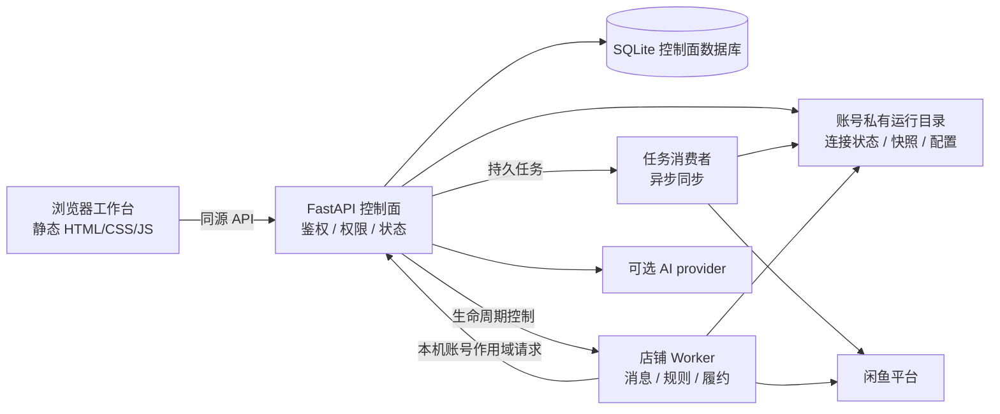

# 架构概览

xianyu-saas 是一个单仓库、分进程、按用户和店铺账号隔离的客服工作台。前端保持静态轻量，FastAPI 控制面负责身份、权限和状态，Worker 负责平台消息与履约。

## 数据流

## 组件边界

### `frontend/`

静态工作台，负责页面展示、表单和请求作用域提示。浏览器不保存平台 Cookie、Token 或长期模型密钥；后端仍是最终鉴权和账号边界。

### `backend/`

FastAPI 控制面负责：

- 登录、会话、角色和账号/店铺作用域；
- 官方二维码连接、商品同步和状态转换；
- SQLite 数据、持久任务、租约、审计摘要和 Worker 生命周期；
- 私有配置初始化、校验和敏感字段过滤；
- AI 统一回复引擎与 provider 连接；
- 人工回复 outbox、版本更新和管理接口。

### `backend/job_consumer.py`

独立消费异步店铺同步任务。任务载荷不保存平台 Cookie 原文，使用账号作用域、租约、有限重试和死信状态。

### `worker/`

每个店铺账号一个受控进程，负责 WebSocket 入站、入站幂等、固定规则、AI 候选、人工回复和订单证明后的履约。人工回复可以包含最多 8 张图片和文字，按图片顺序发送并逐部分确认。

### `deploy/`

提供 Nginx、systemd、日志轮转和签名版本更新模板。路径、域名、用户和密钥由部署环境配置，不应把真实运行态复制到仓库。

### 根目录容器化

`Dockerfile`、`docker-compose.yml` 和 `docker/entrypoint.sh` 提供整站容器运行方式。backend 与 worker 在同一镜像中，以便控制面派生 Worker；容器方式与 `deploy/` 的 systemd 版本化切换互斥。

## 一致性与安全规则

1. 可写数据绑定用户和店铺账号；客户端不能自行声明目录或跨店铺标识。
2. 配置缺失或损坏时安全关闭自动化；显式初始化才会播种默认配置。
3. AI 回复实际发送前复核自动化状态、AI 状态、配置版本、人工接管和幂等状态。
4. 人工 outbox 采用发送期租约、稳定消息标识和有限重试；失败只重试未确认的部分。
5. 自动履约必须有完整订单证明和事务库存预留；AI、买家文字和商品标题不能授权发货。
6. 平台协议 ACK 只表示协议层接收，不等于买家已读或最终送达。
7. 真实平台、真实模型、真实订单和生产发布需要单独受控验收。

## 平台依赖

控制面使用 Linux 进程和文件系统能力限制 Worker、校验进程身份并保证单实例控制面。Windows 和 macOS 建议通过 Docker 运行；源码方式主要面向 Linux。

## 代码导航

| 目标 | 入口 |
| --- | --- |
| API 路由与控制面 | `backend/app.py` |
| 数据库与任务 | `backend/db.py` |
| Worker 生命周期 | `backend/bot_manager.py` |
| 异步同步 | `backend/job_consumer.py` |
| AI 内容与 provider | `backend/ai_customer_service.py`、`backend/ai_provider_adapters.py` |
| 消息与履约 | `worker/main.py`、`worker/context_manager.py`、`worker/delivery_store.py` |
| 前端状态 | `frontend/assets/app.js` |
| 容器运行 | `Dockerfile`、`docker-compose.yml`、`docker/entrypoint.sh` |
| systemd 发布 | `deploy/systemd/`、`deploy/updater/` |
| 离线合同 | `tests/`、`worker/tests/` |
